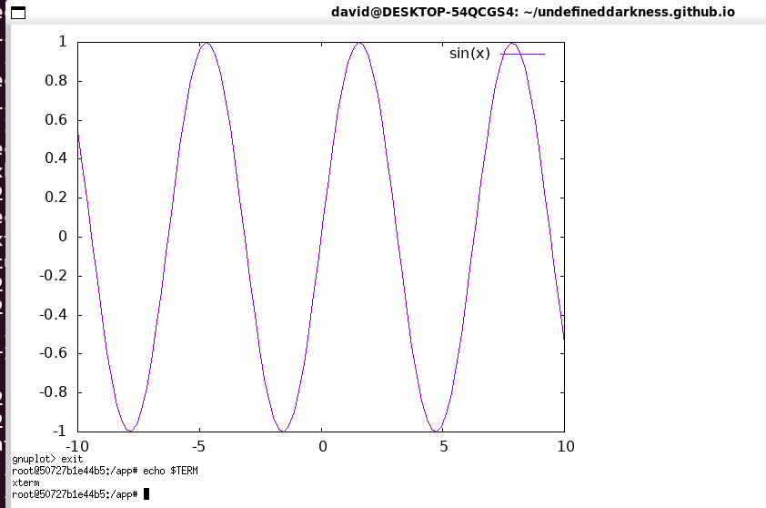

#HEADER Terminal tips \& tricks
😎
#END HEADER
Just a few things Ive learnt after spending a lot of time in a lot of different terminals.

## xterm
### neovim
One day while tweaking my colourscheme, I noticed that my neovim wasn't displaying any italics
like I had specified in it. After double checking that everything was fine from my configuration side, I resolved it to be something between neovim and the terminal.

An hour of googling and trying a bunch of different fixes ensue, But most nothing happens till I try running neovim through the `env` program, forcibly overriding the `XTERM_VERSION` variable to be empty, This finally gave the correct behaviour.

### sixel
Seems like some kind of bug?, Maybe its because my xterm is run in vt340 mode to allow sixel support (Yes, xterm has sixel!!!)

To enable it launch it with `-ti vt340` or if you are using Xrdb to configure it
`xterm*decTerminalID: vt340`

### OSC 52
One of my biggest peeves with tmux was that copy-paste was very unintuitive and especially to get it into the system clipboard was a pain even on the same machine, Let alone a machine that I am ssh'd into. This was the one thing that made me create like 8 different panes instead of using tmux but recently I found a feature that fully solves this but it requires both the terminal and tmux to be configured to use it.

The [OSC 52](https://ghostty.org/docs/vt/osc/52) escape codes allow a terminal to copy into your clipboard and optionally read from it as well (this is usually disabled for security), The benefit of it being an escape code is that any application that is sending text to the terminal (through ssh, tmux or whatever) can copy into the clipboard so you can use it to copy text from tmux within an ssh session.

To enable it, you must have a supported terminal emulator and enable it in [the terminal emulator](https://github.com/tmux/tmux/wiki/Clipboard) and in tmux with `set -g set-clipboard on`

For xterm, it is: `XTerm*disallowedWindowOps: 20,21,SetXprop`

*NOTE*: VTE (Gnome based, terminator etc) do not support it as of yet.
