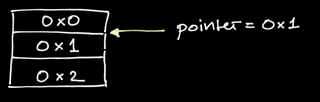
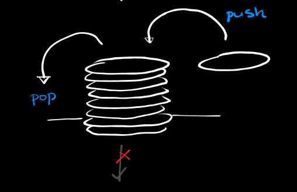
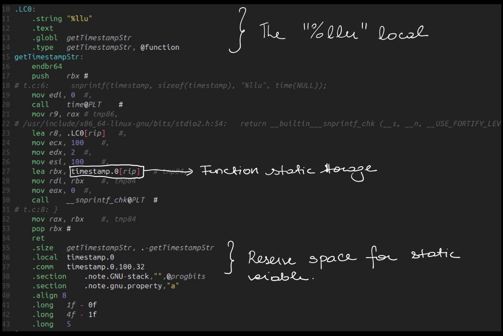
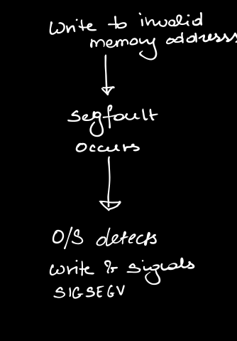
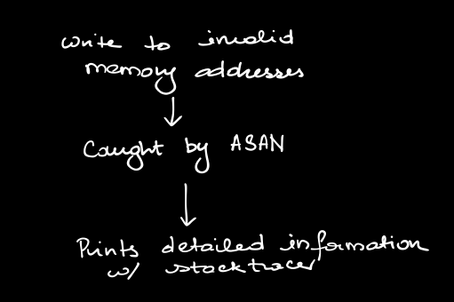
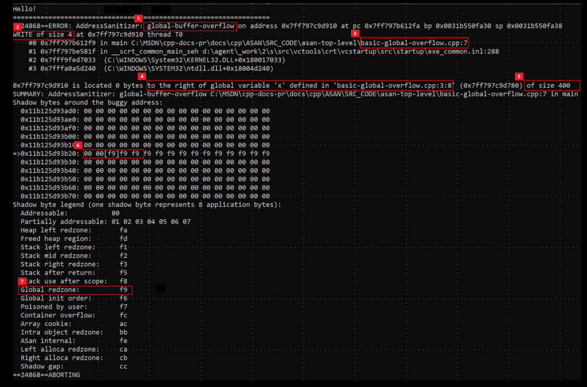

# Basic Memory Introduction

An introduction to low-level programming and how to avoid

```c
$./a.out  
105  
Core Dumped.
```

Note: I've pretty much only covered the kinds of errors you'd encounter in a single threaded program.

going over why it happens, how to diagnose compiled (C/C++) programs & how to fix it.

I wrote assuming the reader has experience in some garbage collected language like Python or Javascript.

# Why

In many languages deemed high level or easy to use the main thing allowing this easy development without directly caring about the underlying memory & addresses is a garbage collector, on a very high level they work like this:

```csharp
int func() {
String x = "APPLE"; → "APPLE" allocated
func2(x); → Copy of x made & tracked.
x = "ORANGE"; → "APPLE" removed & "ORANGE" allocated
}
```

This is a very rough example to give out an idea of its purpose, there are many different ways a garbage collector can function. See the working of the Java or the C# GC if you're interested in the engineering behind them.

- Reference Counter → Increment a counter each time the obj is referenced & decr. later.
- Mark & Sweep → Mark objects for cleanup.
- Generational Collection → Divide into young & old gens of objects.

All in all, GCs are fantastic bits of engg. that make the vast majority of coding relatively hassle free by removing the work of the coder to manage memory.

But if you're reading this, you already decided you can't use one or for the following use cases might be suboptimal,

- Byte Wrangling: You're moving around a lot of large buffers around & you can't afford any overhead in copying & in general want to interact with the bytes correctly.

- Latency sensitive code: What you're working on is real-time or cannot handle a GC pause at any time.
(GC pause -> microseconds your program's execution could be paused to free() objects.)

- High Performance: This is a bad reason to chase after C, C++, Rust for, you can get fast code in all the languages but it's true that compiled languages tend to be closer to the hardware so can be optimized at a lower level.

*: Be careful of choosing a hard lang. simply b/c you think something like C# would be too slow, chances are good C# code can outperform the equivalent code in Rust (e.g.).

It all depends on the *algorithms* & the data structures you employ. 

## How

### Primer
I'm going to over a few concepts here so that I can use the terms I'm comfortable later.

Byte -> A collection of 8 bits. [ uint8_t ]

Slice / Span -> A struct consisting of a ptr & a length (bytes).
struct -> A collection of multiple diff data types together.

Pointer -> An offset into program memory, can encode the type of object its pointing to.
Could point to multiple objects in sequence but you can't infer that from its type.

void* -> Anything

int* -> Integer(s)

Program memory can be thought of as a long (very long) tape where each slot in that tape can hold a byte (Byte addressable).




### Heap / Stack
You can think of this tape as being divided into 2 kinds, A fast tape w/ limited qty & one bulk cheap tape but its slower.

The fast tape is the Stack, the other is Heap

The stack is already managed for you & You manually manage the heap.

#### Allocating / Freeing:
This mostly applies to the heap & not the stack since that one is already managed for you.

When you want to put say 500 numbers on the heap, you need a pointer to 500 * 4 bytes of free space, You can't simply point a pointer to any memory address that is not given to your program by the OS, So you have to humbly request the OS for these 2e³ bytes of free space, this process of asking for memory from the operating system is called allocation.Allocating / Freeing:

This mostly applies to the heap & not the stack since that one is already managed for you.

When you want to put say 500 numbers on the heap, you need a pointer to 500 * 4 bytes of free space, You can't simply point a pointer to any memory address that is not given to your program by the OS, So you have to humbly request the OS for these 2e³ bytes of free space, this process of asking for memory from the operating system is called allocation.

![(./image-1.png)

The opposite process, returning the memory to the operating system (ie giving up ownership) is called freeing.

**Segmentation Fault (SIGSEGV)**: When your program tries to access memory it doesnt have access to, the OS kills the process & raises a segfault error.

**String**: Since I’m mostly writing from the perspective of a C programmer, the string I will be referring to is a C-string.
Note: The string is stored w/ no length & is terminated with a NULL byte (\0)


### Reverse
I feel the easiest way to go at will be to re-tread common issues you could face & see whats going on & how to solve it.

**Returning a stack string** (I specify stack since a heap pointer can be passed around till the pointer is freed. whereas a stack pointer will be invalid after the block its declared in)

Lets take the following:

```c
1. char* getTimestampStr( ) {
2.     char timestamp[100];
3.     snprintf(timestamp, sizeof(timestamp), "%llu", time(NULL));
4.		return timestamp;
5. }
```

In line 2, we declare a variable ‘timestamp’ to be 100 chars [ notice theres no allocation so this a stack variable ] -> Using sprintf()In this we put the UNIX timestamp into that variable

sizeof(X) -> Gives the size of a data type as known at compile time, Not useful for pointers since itll return the no of bytes to store the pointer (8 bytes)

If you replace the data type of timestamp w/ this you’ll get 8 also -> sizeof((char*)timestamp);((char*) prefix is casting away the known array type.)

Then after insertion, the function returns the variable as a pointer.(C doesnt have proper ‘ARRAY’ types so any array is fundamentally a pointer to memory.)

But this will fail since the pointer returned by the function will be invalid.This will be easiest to show with the assembly:

The following ASM is for AMD64 (SysV calling convention)

**getTimestampStr:**

Code snippet
```x86asm
    push rbx    -> Store callee address on stack
.1  sub rsp, 112 -> Reserve 100 bytes on the stack
    xor edi, edi -> Zero out EDI register
    call time@PLT -> Call time(EDI=0)
    lea rdx, [rip + .L.str] -> Store &"%llu"
.2  mov rbx, rsp -> Store address of stack space
    mov esi, 100 -> Store sizeof(timestamp)
    mov rdi, rbx -> Copy buffer address <-- (Arrow indicating flow)
    mov rcx, rax -> Store output of time(NULL)
    xor eax, eax -> Mark as multiple variadic arguments
    call snprintf@PLT -> Call snprintf(rdi, rsi, rdx, rcx)
    mov rax, rbx -> RAX = RBX = Buffer pointer
.3  add rsp, 112 -> "Unreserve" stack space
    pop rbx -> Restore callee address
    ret
```

If you havent messed w/ assembly registers, heres what you need to understand:

**Stack (Data Structure)**: Think of a stack of plates.(Diagram of a stack of plates with arrows indicating 'push' adding to the top and 'pop' removing from the top) You can push new elements to the end of the stack, You can only pop the last inserted element -> I.e the element at the top of the stack.



The CPU Stack (from w/h we derive stack memory from) is basically some scratch space (think like a rough notebook) whenever it needs some memory & It cant use its registers (insufficient space/data to be stored for later); So stack memory really refers to data stored on this stack.

The CPU has a stack register (ESP) & instructions only for pushing & popping data from the stack.

Pushing data increments the SP Popping data decrements the SP

**Now we can look at the instructions,**

1 → This reserves 112 bytes of space on the stack (112 → 100 + rounding to 16b boundary)

2 → Sets the address of the array to the current stack pointer address.

3 → Unreserves the stack space (cleanup).

I hope the problem is very visible now, the stack space isn't reserved at all so any future code that modifies the stack will clobber the char array so corrupting our string → Makes the returned pointer pointless.

Theres 3 ways we can solve this, you shouldve thought of 1 already.

Solutions
- (A) Reserve the static memory

- (B) Use the heap

- (C) Ask the caller to provide a buffer to write to

Once you're done, you'll start to notice almost all C apis using (B) or (C) in order to pass non primative data back to the caller.

(A) This is done by making the array static


Also this is impractical for large objects like several megabytes in size. Its best for singletons or for function returns that are expected to be used then discarded before the next function call.

The main problem w/ this approach is that you cant use it on-demand.

The storage is attached to this storage so if you did this:

```c
getTimestampStr()
    |-> Stores "T+0" in static variable space & returns pointer to it
getTimestamp()
    |-> Stores "T+1" in static variable
```
After the 2nd call, the first functions output is removed/replaced.

**(B)** This is done by manually allocating memory & manually freeing it. Say you have an object w/ some max or known size, & the size is > than say 4kB (4096 bytes), Its a good candidate to be heap allocated, Its also really useful if the object size could change in the future / it needs to be passed around.

In our example, we have a timestamp array (max 100 bytes in size), that we've determined to be max 100 bytes in size, we can get a pointer to 100 bytes of space on the heap using malloc() (MAN).

```c
char* timestamp = (char*) malloc(sizeof(char) * 100);
```
Notice that we can no longer keep the array size w/ its type since the compiler is unaware of what malloc() is doing, It only knows it will return a void* pointer.

So its up to us to make sure we are always in bounds of our heap variables or we can run into segfault.

So since sizeof(timestamp) no longer knows the size of our array, we have to hardcode it:

```c
snprintf(timestamp, 100, "%llu", time(NULL));
```
For this reason of often associating the size of our obtained pointer its very common to see a struct like this:

```c
struct slice_t {
    void* ptr;
    size_t len; 
} 
// The correctly sized int type to hold any possible memory size
```
This is very often used type in Zig or other languages.

Once we are done using the heap memory object, Its common to free() it. This returns the memory to the OS for further use.

If you continually allocate memory without freeing it, thats called a memory leak & eventually the system wont allocate any more memory (OOM).

```c
free(timestamp);
```

Remember to only call free() once after the memory is used. If you call free again on a already freed pointer that is a double free error. The pointer that is freed is no longer valid after its freed. Using a freed pointer will cause a use after free error or a segfault.

If you want to resize the block given by malloc() use realloc()

```c
timestamp = realloc(timestamp, 2000);
```

timestamp is now 2kb - Original data is reserved

**(C)** This is a way of simply not making it your problem, You make it the callers responsibility to allocate & give you a large enough buffer which can be either heap or stack allocated.

The function can be changed to:

```c
void getTimestampStr(char* buf, size_t buf_s) {
    snprintf(buf, buf_s, "%llu", time(NULL));
}
```
& it would be called like this:

STACK

```c
int main() {
    char ts[100];
    getTimestampStr(ts[0], sizeof(ts));
}
```

HEAP

```C
int main() {
    char ts* = (char*)malloc(1024);
    getTimestampStr(ts, 1024);
}
```

This one is best if you want the buffer size to be configurable or if the function directly writes to a byte array.

## DEBUGGING INTRODUCTION

Even following best practices, you can very easily reach a segfault & it will make you a lot more confident if you can triage/diagnose & remedy it. The diagnosis & remedy will depend on your specific project but I can show you some ways to triage issues.

Generally mapping a breakpoint to source code requires the program to be compiled w/ debugging information. i.e → it should not be stripped. ( Has 'extra' info removed. )

### -faddress-sanitizer 
This compiler flag enables the address sanitizer or ASAN. How it works isnt exactly relevant but you can think of it like this:







As you can see, it provides the line no. of where the memory error occurred & a stacktrace.

Alternatively you can use a debugger. Im not going to go very in-depth on this since there is simply so much you can do using a debugger but for ‘basic’ debugging, what you need is:

1) The executable must be built with debug symbols. Generally this is done with -g.

Note: The optimization level you compile with will determine the kind of assembly you inspect, use -O0 for the closest equivalent of your C code.

2) Run your program

3) When an exception occurs, inspect the backtrace & the stack / variables

You can also set breakpts. for the prog. to auto stop w/n reached & watch variables for when they are read or written to.

Based on the images provided, the first four images (image_1133c8.png, image_1133ef.png, image_119128.jpg, image_1198ce.jpg) appear to be the same pages we transcribed in the previous turns (covering the Stack issue, Assembly, and Solutions A, B, & C).

Here is the transcription for the new page (image_120644.png) which concludes the debugging section and adds some miscellaneous notes.

Debugging (Continued)
Alternatively you can use a debugger. Im not going to go very in-depth on this since there is simply so much you can do using a debugger but for ‘basic’ debugging, what you need is:

1) The executable must be built with debug symbols. Generally this is done with -g.

Note: The optimization level you compile with will determine the kind of assembly you inspect, use -O0 for the closest equivalent of your C code.

2) Run your program

3) When an exception occurs, inspect the backtrace & the stack / variables

You can also set breakpts. for the prog. to auto stop w/n reached & watch variables for when they are read or written to.

## MISC
Tools like ClangD w/ Clang Format turned on can help you catch errors early.

Simple Rule of Thumb is whenever passing a pointer to MULTIPLE elements, pass in a length parameter as well.

(*) I apologize for the constant shifts in the size of my handwriting, It took me a while to figure that I should keep it large & consistent for legibility.

I wouldve typed but if I did that I wouldve never finished it ehehe.