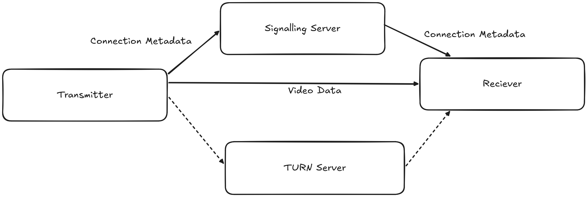

#HEADER Low Latency Camera Streaming in Robotics
Lessons from debugging flaky, laggy camera streams on robots.
#END HEADER
So as part of my work at Dreadnought Robotics and a few other places since, I've often had to grapple with and sort out why a camera stream is not performing as it should and this can have many reasons like purely from my experience I've seen things 

- like the USB / Ethernet cable being too fragile
    We needed to connect a USB camera that was under our bot to the main compute within the bot and the only entry was through a penetrator only designed for thinner ethernet wires and we also mostly had lots of high quality ethernet tether so we had to frankenstein a USB -> Ethernet -> USB setup. This worked on a good day but it was also very fragile
- the USB 2.0 cable being re-soldered so many times 
    it has to be re-twisted now and then to properly transmit data or the bandwidth drops and the framerate goes to like 3 or 5 from an expected 60 and if you didn't know about the cable issue you'd not figure it out
    The insulation had also been cut so the strands didnt have anything holding them together :) 

So this documents my research and I guess my frustration finding a "sort" of way to get a low latency camera stream working across multiple different setups with different compute, different architectures etc, My experience has mostly been with USB cameras (for the receiving frames side) but the publishing side will hold true for any camera.

So to fully illustrate how this entire pipeline works and to appreciate the complexity of cameras somewhat, I am going to go through the entire thing, It'll be a bit abstract at parts I am not super familiar but I'll try to be as in depth as I can

## How do digital cameras work
### Sensor / Bayer Filter
So the camera is made up of a grid of photo cells, these cells can only measure luminance, as in how bright the light hitting it is, this grid is then read either row by row (CCA) or each cell can be read individually (CMOS), Most cameras today follow the CMOS architecture since it easier and hence cheaper to manufacture.

But as you can imagine, a grid of luminence sensors isnt exactly sufficient to percieve colour so this is where colour filters come in. Unlike the human eye which has cones and rods for colour & luminence respectivley, Camera sensors need some way to filter the luminence they recieve to a particular colour spectrum, This is usually done with a bayer filter.

#COLUMNS


#END COLUMNS

This seperates the colours coming into the sensor, and since the pattern is repeated you can take the image from the sensor with the filter applied and "debayer" it to compute the R, G, B values for each pixel. (If you notice there are twice as many green spots on the filter compared to red & blue, because we percieve green more strongly than red or blue)

#f <h3> Image Signal Processor (ISP)</h3>
This isn't something you need to worry about with USB or Ethernet cameras since they have an integrated ISP that takes care of reading data from the camera sensor, debayering it etc and presenting it in a format you can easily consume (USB is usually V4l2 & Ethernet can be custom), But if you are dealing with MIPI CSI cameras then you need to worry about this, since then, the sensor is directly connected to your devboard and the devboards internal ISP must be configured to communicate with the camera sensor, which if not included in your devices kernel (Raspi thankfully supports majority), can end up with you needing to edit files that look like this:

```dtb
...
&{/} {
	clk_csi0_imx219_fixed: csi0-imx219-xclk {
		compatible = "fixed-clock";
		#clock-cells = <0>;
		clock-frequency = <24000000>;
	};
};

&mcu_gpio0 {
    status = "okay";
};

&main_i2c2 {
	status = "okay";
	pinctrl-names = "default";
	pinctrl-0 = <&main_i2c2_pins_default>;
	clock-frequency = <400000>;

	#address-cells = <1>;
	#size-cells = <0>;

	imx219_0: sensor@10 {
		compatible = "sony,imx219";
		reg = <0x10>;

		clocks = <&clk_csi0_imx219_fixed>;
		clock-names = "xclk";

		pinctrl-names = "default";
		pinctrl-0 = <&csi0_gpio_pins_default>;

		reset-gpios = <&mcu_gpio0 15 GPIO_ACTIVE_HIGH>;

		port {
			csi2_cam0: endpoint {
				remote-endpoint = <&csi2rx0_in_sensor>;
				link-frequencies = /bits/ 64 <456000000>;
				clock-lanes = <0>;
...
```

Suffice to say its a big hassle and when you need to handle it, it takes forever to properly integrate the camera hardware, especially if documentation is unsatisfactory

#END f

### Video4Linux (USB / Standards compliant cameras)
So this is the linux subsystem that is in charge of all video device aquistion, enumeration and handling on linux, It is what lets you configure the camera properties like exposure, auto focus etc and for this article most importantly it lets you query all the devices and shows you all the different streams it supports, a *stream* is just a valid configuration of FORMAT, RESOLUTION & FPS that the device **currently** supports and is capable of publishing.

[V4l2 Documentation](https://www.linuxtv.org/downloads/v4l-dvb-apis-new/userspace-api/v4l/v4l2.html)

So for example my laptop webcam supports the following:
```
$ v4l2-ctl --all
Driver Info:
        Driver name      : uvcvideo
        Card type        : Integrated Camera: Integrated C
        Bus info         : usb-0000:05:00.3-3
        Driver version   : 6.8.12
        Capabilities     : 0x84a00001
                Video Capture
                Metadata Capture
                Streaming
                Extended Pix Format
                Device Capabilities
        Device Caps      : 0x04200001
                Video Capture
                Streaming
                Extended Pix Format
Media Driver Info:
```

Here you can see all the different options exposed by the device to the `uvcvideo` driver. Typically cameras support a few image formats, I have so far only seen (rarely) H.264, MJPEG, YUV422 and NV12. These are all useful for different things, Typically unless you need the perfectly raw image from the camera, MJPEG will serve your needs very well, You can see how much bandwidth each of these consume:

#CHART ylog=true unit=Mbps width=700 height=400 interactive=false title=Bandwidth (log scale)
category	1080p 30fps	1080p 60fps	720p 30fps	720p 60fps
H.264	8	16	4	8
H.265	4	8	2	4
AV1	3	6	1.5	3
VP9	4.5	9	2	4
MJPEG	50	100	22	44
NV12/I420	373	746	166	332
YUV422	497	995	221	442
YUV444	746	1493	332	664
RAW10	715	1430	319	637
RAW12	857	1714	382	764
RGB24	1492	2985	664	1328
#END CHART

#TABLE	Format	Type	1080p/30fps	1080p/60fps	720p/30fps	720p/60fps
H.264	Compressed	8 Mbps	16 Mbps	4 Mbps	8 Mbps
H.265/HEVC	Compressed	4 Mbps	8 Mbps	2 Mbps	4 Mbps
AV1	Compressed	3 Mbps	6 Mbps	1.5 Mbps	3 Mbps
VP9	Compressed	4.5 Mbps	9 Mbps	2 Mbps	4 Mbps
MJPEG	Compressed	50 Mbps	100 Mbps	22 Mbps	44 Mbps
NV12 (YUV 4:2:0)	Uncompressed	373 Mbps	746 Mbps	166 Mbps	332 Mbps
YUV 4:2:2 (YUYV)	Uncompressed	497 Mbps	995 Mbps	221 Mbps	442 Mbps
YUV 4:4:4	Uncompressed	746 Mbps	1.46 Gbps	332 Mbps	664 Mbps
RAW10 Bayer	Uncompressed	715 Mbps	1.40 Gbps	319 Mbps	637 Mbps
RAW12 Bayer	Uncompressed	857 Mbps	1.67 Gbps	382 Mbps	764 Mbps
RGB24	Uncompressed	1.46 Gbps	2.91 Gbps	664 Mbps	1.30 Gbps
#END TABLE

*The numbers for the compressed formats vary depending on the compression settings and the actual content of the image*

Few cameras support directly streaming H264 or compressed video output directly so mostly you are dealing with either MJPEG or the compressed format of your choosing (please choose NV12 if you can).

For the small sizes of the video formats should give you a hint of where we are going next.

```
        Model            : Integrated Camera: Integrated C
        Serial           :
        Bus info         : usb-0000:05:00.3-3
        Media version    : 6.8.12
        Hardware revision: 0x00002510 (9488)
        Driver version   : 6.8.12
Interface Info:
        ID               : 0x03000002
        Type             : V4L Video
Entity Info:
        ID               : 0x00000001 (1)
        Name             : Integrated Camera: Integrated C
        Function         : V4L2 I/O
        Flags            : default
        Pad 0x01000007   : 0: Sink
          Link 0x02000013: from remote pad 0x100000a of entity 'Extension 4' (Video Pixel Formatter): Data, Enabled, Immutable
Priority: 2
Video input : 0 (Camera 1: ok)
Format Video Capture:
        Width/Height      : 1280/720
        Pixel Format      : 'MJPG' (Motion-JPEG)
        Field             : None
        Bytes per Line    : 0
        Size Image        : 1843200
        Colorspace        : sRGB
        Transfer Function : Rec. 709
        YCbCr/HSV Encoding: Rec. 709
        Quantization      : Default (maps to Full Range)
        Flags             :
Crop Capability Video Capture:
        Bounds      : Left 0, Top 0, Width 1280, Height 720
        Default     : Left 0, Top 0, Width 1280, Height 720
        Pixel Aspect: 1/1
Selection Video Capture: crop_default, Left 0, Top 0, Width 1280, Height 720, Flags:
Selection Video Capture: crop_bounds, Left 0, Top 0, Width 1280, Height 720, Flags:
Streaming Parameters Video Capture:
        Capabilities     : timeperframe
        Frames per second: 30.000 (30/1)
        Read buffers     : 0

User Controls

                     brightness 0x00980900 (int)    : min=0 max=255 step=1 default=128 value=128
                       contrast 0x00980901 (int)    : min=0 max=100 step=1 default=32 value=32
                     saturation 0x00980902 (int)    : min=0 max=100 step=1 default=64 value=64
                            hue 0x00980903 (int)    : min=-180 max=180 step=1 default=0 value=0
        white_balance_automatic 0x0098090c (bool)   : default=1 value=1
                          gamma 0x00980910 (int)    : min=90 max=150 step=1 default=120 value=120
           power_line_frequency 0x00980918 (menu)   : min=0 max=2 default=1 value=1 (50 Hz)
                                0: Disabled
                                1: 50 Hz
                                2: 60 Hz
      white_balance_temperature 0x0098091a (int)    : min=2800 max=6500 step=1 default=4600 value=4600 flags=inactive
                      sharpness 0x0098091b (int)    : min=0 max=7 step=1 default=3 value=3
         backlight_compensation 0x0098091c (int)    : min=0 max=2 step=1 default=1 value=1

Camera Controls

                  auto_exposure 0x009a0901 (menu)   : min=0 max=3 default=3 value=3 (Aperture Priority Mode)
                                1: Manual Mode
                                3: Aperture Priority Mode
         exposure_time_absolute 0x009a0902 (int)    : min=2 max=1250 step=1 default=156 value=156 flags=inactive
     exposure_dynamic_framerate 0x009a0903 (bool)   : default=0 value=1
                        privacy 0x009a0910 (bool)   : default=0 value=0 flags=read-only
```

## On device image pub sub
Once you have obtained your image in memory in some known format (typically RGB, NV12 or YUV422) there will typically be multiple applications that need to use it, and they might all want it in a different format, resolution & framerate etc.

So your publishing system must be able to easily handle creating multiple streams and providing scripts data where it is wanted (eg: ML scripts will typically want a resized image of RGB format in the GPU)

The solution you would most easily reach for is ROS since that is what you have been using for all your other sensors & data. But images & large data in general is a place where ROS really does not shine.  In my experience it will reliably transfer frames but a 30FPS is typically a 15-20FPS frame stream after going through ROS.

By default ROS transfers image raw over the network, a 720p RGB image becomes `1280 * 720 * 3 + 56 = ~2.7MB` bytes (the 56 is the frame header)

For 60fps this demands a bandwidth of `2.8 * 60 / 1000 = ~165MB/s = ~1.33Gbps` purely for a single image stream & typically you will have multiple streams based on the number of nodes working on it and possible streams of multiple cameras and different resolutions, formats etc.

This becomes better with `image_transport` but this isn't directly supported  in `rclpy` so almost always you end up with the raw stream in my experience.
(There is support added but not everyone architects their scripts with it / around it) - and then I have found it to be kind of a stop-gap solution that doesn't fully solve the problem every time.

I wish I could show this with benchmarks but its something that happens when the system is under load of other things (like DAQ, control loops etc) and typically embedded systems less apable from your typical laptop. I should capture a pcap of a system while it is running.

Typically also in image pipelines you want to avoid copies and ROS does about 3-4 copies per image. Obviously all these latencies compound with larger images and higher framerates.

This framerate that fluctuates under load is something I have been chasing a solutions for my entire time in Dreadnought and these are the solutions I have found that work

### iceoryx (shared memory, zero copy)
Even just avoiding sending the image over the network and keeping it on the same device and trying to avoid copies can make a large difference, You can also _technically_ do this with the ROS2 RMW backends [CycloneDDS](https://cyclonedds.io/docs/cyclonedds/0.8.2/shared_memory.html) & [FastDDS](https://github.com/eProsima/rmw_fastrtps?tab=readme-ov-file#enable-zero-copy-data-sharing) but I have not that work well for me.

So I have mostly been using [iceoryx](https://github.com/eclipse-iceoryx/iceoryx) as a separate pub-sub system alongside ROS for larger data (like laser profiler batches) with a config like this:
```toml
[general]
version = 1

[[segment]]

    # ── Small pools (iceoryx internal: service discovery, heartbeats, routing) ──
    [[segment.mempool]]
    size  = 128
    count = 1000

    [[segment.mempool]]
    size  = 1024
    count = 500

    [[segment.mempool]]
    size  = 16384
    count = 200

    # ── camera payload pool ─────────────────────────────────────────────
    # Covers 1440×1080 BayerRG8 (1.5 MB + iceoryx overhead). Increase size to
    # ~16 MiB if running 2448×2048 RGB8 cameras; reduce count if RAM is tight.
    [[segment.mempool]]
    size  = 2097152     # 2 MiB
    count = 300         # 300 × 2 MiB = 600 MB
```

Typically you should create a different `mempool` for each kind of message type you expect to have and give it a sufficient amount of reserved slots (`count`) to cope with traffic.
#CALLOUT note
ROS2 sometimes includes an out of date version of iceoryx, I recommend to compile & build it from source then use `iox-roudi` from `/usr/local/bin` (which is where the source build installs it) instead of the one included in ROS2.
#END CALLOUT

### motion-jpeg (mjpeg)
When trying to display the stream you either need a custom viewer script (ROS has this with `rviz` & `image_view`) or the format needs to be one of `mjpeg` or `rtsp`. 

Even when trying to display your live video stream in the browser or any kind of front end your best bet without streaming to the cloud is `mjpeg` or WebRTC - if you are streaming to the cloud then you can transcode and display it however you live, typically I think HLS is used.

But displaying with webrtc is a whole _process_ in of itself, since typically the flow looks something like


So you need *another* server besides the main publishing server and the whole neotiation is complicated enough that ffmpeg fully delegates it to [another seperate program](https://github.com/bluenviron/mediamtx) and gstreamer only has a [third party plugin](https://gitlab.freedesktop.org/gstreamer/gst-plugins-rs/-/tree/main/net/webrtc?ref_type=heads) that fully implements it (by embedding a signalling server within its sink)

motion jpeg is much simpler, the whole infrastructure to publish a mjpeg stream is this
```cpp
class MjpegStreamer {
public:
  MjpegStreamer(int port, int quality)
      : port_(port), quality_(quality), running_(false), listenFd_(-1),
        currentFrameId_(0) {}

  ~MjpegStreamer() { stop(); }

  void start() {
    if (running_.exchange(true))
      return;
    acceptThread_ = std::thread([this] { acceptLoop(); });
  }

  void stop() {
    if (!running_.exchange(false))
      return;
    if (listenFd_ >= 0) {
      ::shutdown(listenFd_, SHUT_RDWR);
    }
    frameCv_.notify_all();
    if (acceptThread_.joinable()) {
      acceptThread_.join();
    }
    if (listenFd_ >= 0) {
      ::close(listenFd_);
      listenFd_ = -1;
    }
  }

  int getPort() const { return port_; }

  void pushFrame(const cv::Mat &bgr) {
    if (bgr.empty()) {
      return;
    }

    std::vector<uint8_t> jpegBuf;
    std::vector<int> params = {cv::IMWRITE_JPEG_QUALITY, quality_};
    cv::imencode(".jpg", bgr, jpegBuf, params);

    {
      std::lock_guard<std::mutex> lk(frameMtx_);
      frame_ = std::move(jpegBuf);
      currentFrameId_++;
    }
    frameCv_.notify_all();
  }

private:
  static constexpr const char *kHttpHdr =
      "HTTP/1.1 200 OK\r\n"
      "Content-Type: multipart/x-mixed-replace; boundary=mjpeg_boundary\r\n"
      "Cache-Control: no-cache\r\n"
      "Connection: close\r\n"
      "\r\n";

  void acceptLoop() {
    listenFd_ = ::socket(AF_INET, SOCK_STREAM, 0);
    if (listenFd_ < 0) {
      return;
    }
    int opt = 1;
    ::setsockopt(listenFd_, SOL_SOCKET, SO_REUSEADDR, &opt, sizeof(opt));
    sockaddr_in addr{};
    addr.sin_family = AF_INET;
    addr.sin_addr.s_addr = INADDR_ANY;
    addr.sin_port = htons(static_cast<uint16_t>(port_));
    if (::bind(listenFd_, reinterpret_cast<sockaddr *>(&addr), sizeof(addr)) 
        0) {
      ::close(listenFd_);
      listenFd_ = -1;
      return;
    }
    ::listen(listenFd_, 8);

    while (running_.load()) {
      sockaddr_in ca{};
      socklen_t cl = sizeof(ca);
      int fd = ::accept(listenFd_, reinterpret_cast<sockaddr *>(&ca), &cl);
      if (fd < 0) {
        break;
      }
      char rbuf[2048];
      int received = ::recv(fd, rbuf, sizeof(rbuf) - 1, 0);
      if (received > 0) {
        std::thread([this, fd] { serveClient(fd); }).detach();
      } else {
        ::close(fd);
      }
    }
  }

  void serveClient(int fd) {
    if (::send(fd, kHttpHdr, strlen(kHttpHdr), MSG_NOSIGNAL) < 0) {
      ::close(fd);
      return;
    }
    uint64_t lastSentId = 0;
    while (running_.load()) {
      std::vector<uint8_t> jpeg;
      {
        std::unique_lock<std::mutex> lk(frameMtx_);
        frameCv_.wait_for(lk, std::chrono::seconds(2), [this, lastSentId] {
          return currentFrameId_ > lastSentId || !running_.load();
        });
        if (!running_.load())
          break;
        if (currentFrameId_ <= lastSentId)
          continue;
        jpeg = frame_;
        lastSentId = currentFrameId_;
      }
      std::string hdr = "--mjpeg_boundary\r\n"
                        "Content-Type: image/jpeg\r\n"
                        "Content-Length: " +
                        std::to_string(jpeg.size()) +
                        "\r\n"
                        "\r\n";
      if (::send(fd, hdr.data(), hdr.size(), MSG_NOSIGNAL) < 0)
        break;
      if (::send(fd, jpeg.data(), jpeg.size(), MSG_NOSIGNAL) < 0)
        break;
      if (::send(fd, "\r\n", 2, MSG_NOSIGNAL) < 0)
        break;
    }
    ::close(fd);
  }

  int port_;
  int quality_;
  std::atomic<bool> running_;
  int listenFd_;
  std::thread acceptThread_;
  std::mutex frameMtx_;
  std::condition_variable frameCv_;
  std::vector<uint8_t> frame_;
  uint64_t currentFrameId_;
};
```

This works by the `Content-Type: multipart/x-mixed-replace; boundary=mjpeg_boundary` header, which tells the client to expect a stream of data that is separated by a boundary, and that each part of the stream should replace the previous part. 

Each frame is sent like this:
```
--mjpeg_boundary\r\n
Content-Type: image/jpeg\r\n
Content-Length: 48213\r\n
\r\n
[raw JPEG bytes]\r\n
```
The parser knows that the content after the `mjpeg_boundry` is meant to replace the content so the browser will continually update the image as long as the connection is maintained with the server. This format is also compatible with OpenCV, ffmpeg and VLC. Since each frame is a complete JPEG frame the receiving end can also be very simple as long as it understands how to decode a JPEG image.

Here is a little demo that is being live streamed from a vercel service:


#CALLOUT note
Another advantage is that some cameras support directly outputting JPEG encoded frames so you can fully skip the encoding step of raw pixel format -> encoded jpeg image saving some latency when you can fully passthrough frames.
#END CALLOUT

## rtsp
Mjpeg is good enough for many usecases but if you want to minimize bandwidth and not have to worry about latency of each individual copy you have to look into video codecs like H264, These leverage the fact that between 2 individual frames not much content actually changes, so you can store just the _delta_ of what exactly changed between 2 full frames and using these deltas and the *keyframes* you can fully reconstruct the original video.

This is a [better explanation of how these modern codecs work](https://sonnati.wordpress.com/2014/06/20/h265-part-i-technical-overview/), this is for h265 but the same general ideas persist for h264, av1 etc.

Typically the video encoding you choose really depends on what exactly your hardware supports, if you are on Intel you can use the `qsv` family of encoders, nvidia `nvenc` and AMD `amf`, [ffmpeg hwaccel guide](https://trac.ffmpeg.org/wiki/HWAccelIntro) - There are also *generic* accelerated encoders that use [va-api](https://trac.ffmpeg.org/wiki/Hardware/VAAPI), dx11, dx12 or vulkan for acceleration but I find that using the device specific api is reliably better.

On my laptop this is available by default (use [this script](https://gist.github.com/davidnoronha1/e964e4c6c7b07ae30f126a8e7dc12b96) to find for your hardware):
```
  Tool        Vendor / Backend             Codec   Encoder / Element
 ━━━━━━━━━━━━━━━━━━━━━━━━━━━━━━━━━━━━━━━━━━━━━━━━━━━━━━━━━━━━━━━━━━━━
  ffmpeg      NVIDIA                       H.264   h264_nvenc
  ffmpeg      NVIDIA                       HEVC    hevc_nvenc
  ffmpeg      Intel/AMD (VAAPI)            H.264   h264_vaapi
  ffmpeg      Intel/AMD (VAAPI)            HEVC    hevc_vaapi
  gstreamer   NVIDIA (nvcodec)             H.264   nvcudah264enc
  gstreamer   NVIDIA (nvcodec)             H.264   nvautogpuh264enc
  gstreamer   NVIDIA (nvcodec)             HEVC    nvcudah265enc
  gstreamer   NVIDIA (nvcodec)             HEVC    nvautogpuh265enc
```
(I dont have AMF compiled into my ffmpeg)

#CALLOUT note
This worked best for me when vieweing the video feed across multiple different nodes across multiple different machines connected through a 2km long tether. Iceoryx only works within the same machine and Mjpeg was having lag or fluctuating framerate so for multiple nodes on multiple machines this worked best.
#END CALLOUT

RTSP doesn't work to send media to the browser since if you are sending video you need WebRTC or HLS. But for any scripts on your local network you can use it and it is understood by OpenCV, ffmpeg and others (they also understand mjpeg), I've found that setting these flags for the reciever stream helps to priotize latency over perfect frames.
```
export OPENCV_FFMPEG_CAPTURE_OPTIONS="fifo_size;500000|overrun_nonfatal;1|fflags;nobuffer|flags;low_delay|framedrop;1|vf;setpts=0"
```
Which tells ffmpeg to focus on dropping frames and not buffering in order to always provide the latest frame