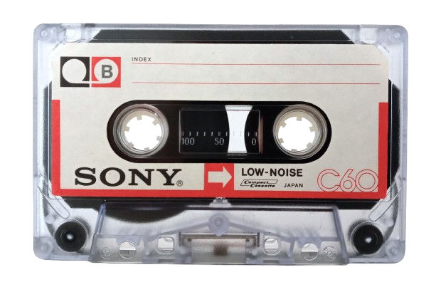
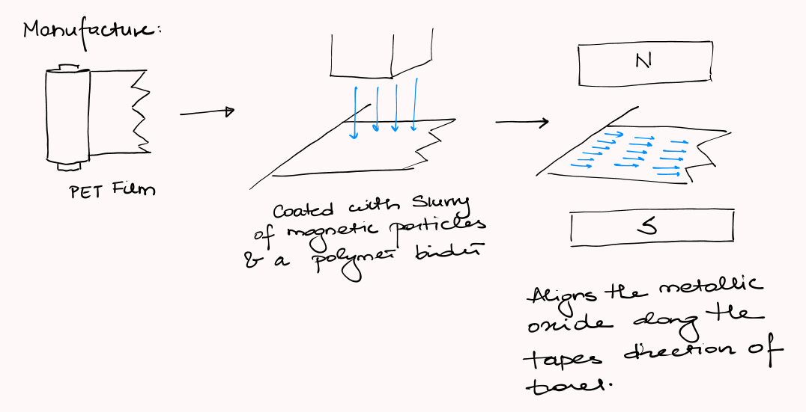
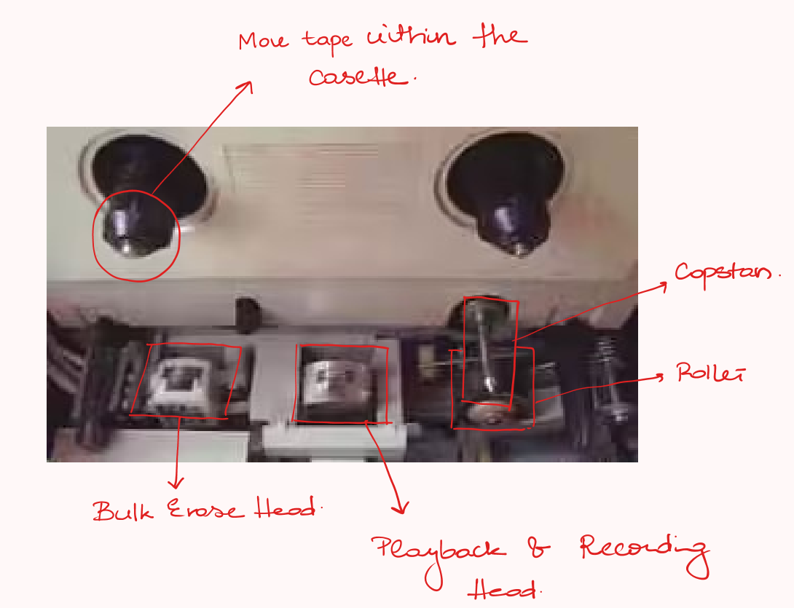
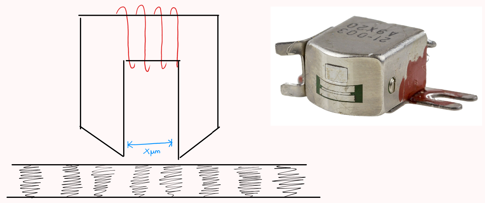
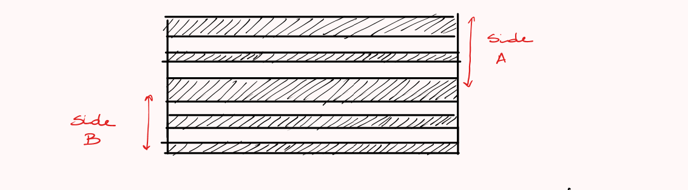
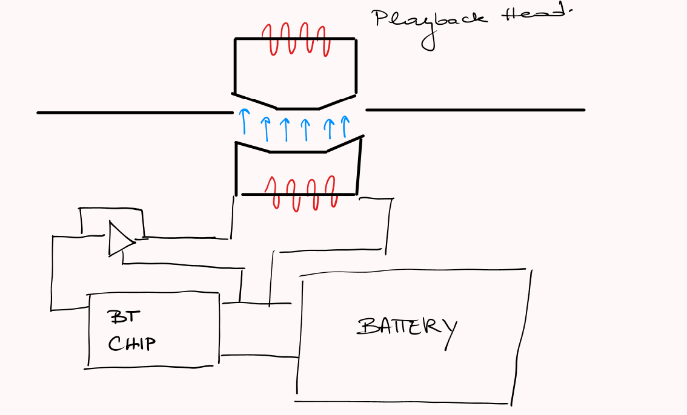

#HEADER Electronic Tape Cassette
How does a tape store signal data?
#END HEADER

### Tape
It consists of a thin plastic tape coated with a coating of ferric oxide powder.
Each region of the coating can be magnetized in a particular direction.
& the pattern of magnetization along the tape encodes the audio signal.

#### Manufacture

### Playback

The capstan rotates at a fixed rate of 4.76×10⁻³ m/s. The roller applies pressure to the tape so that it is aligned with the capstan.

##### Playback Heads

Functions effectively like ½ of a transformer when recording the head is the driver inducing magnetic fields in the tape that reflect the input audio signal.

During playback, the tape is the driver inducing small currents in the coil that reflect the audio signal written to the tape.

On a regular cassette player there are 2 of these electromagnets that are spaced only a few µm apart.

This allows stereo (left + right) channel audio to be encoded.

When you flip the tape, the other end of the tape is aligned to the head.

## Converter
If a playback head is ½ of a transformer then the converter provides the 2nd half.

The inductor inside the tape creates a magnetic field that replicates the analog audio signal of the digital audio.

## Resources
Some nice resources I found when researching this:
- [Technology Connections / Cassette Adapters are surprisingly simple](https://www.youtube.com/watch?v=dH4n8fUjtLQ)
- [Panasonic Technical Terms](https://ant-audio.co.uk/Tape_Recording/Library/PTRTT.pdf)
- [JVC Service Guide Cassette](https://ant-audio.co.uk/Tape_Recording/Library/JVC_Service_Guide_Cassette_Mech.pdf) (This details how the tape is moved within the tape deck)
- [BASF Inventor's Notebook - Cassette Housing](https://ant-audio.co.uk/Tape_Recording/Library/Cassette_Housing.pdf)
- [IEC 94 - Magnetic Tape Sound Recording Systems](/assets/documents/IEC_94_Magnetic_Tape_Sound_Recording_Systems_Parts_1-11.pdf) (See part 7)