#HEADER Mira: Autonomous Underwater Vehicle for SAUVC & TAC date=2026-10-09
Lessons learned designing, building, and programming Mira, an autonomous underwater vehicle for SAUVC and TAC.
#END HEADER

## Introduction

In my 2nd year of college, I joined Dreadnought Robotics, an underwater robotics team that had just returned from competing in the Tau Autonomy Center Challenge (TAC) 2024 and had managed to secure 2nd place.

Not long after I joined, development started for the Singapore Autonomous Underwater Vehicle Challenge (SAUVC). As a member of the programming department I was working on both the system integration of the various software subsystems and developing the routines for each of the SAUVC tasks.

After an unsuccessful competition in Singapore due to electrical failures, our seniors passed the mantle on to us and we earnestly began preparing for the TAC competition the next year, with the help of our juniors.

Around this time we also had our official board transfer and I was made Programming Head, in charge of the entire software stack for the competitions and of the knowledge transfer and holistic development of myself and my juniors. The goal was to ensure we had a reliable software stack, one that is pleasant to work on (Developer Experience), and that once we left there would be people with sufficient knowledge and know-how to take over without needing to re-learn anything.

## Architecture

### Mechanical

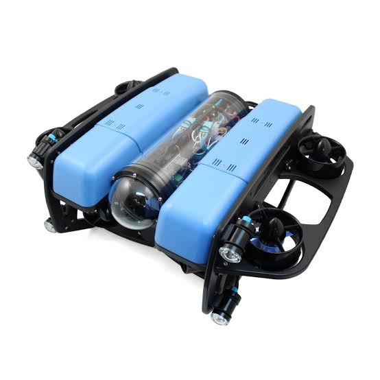
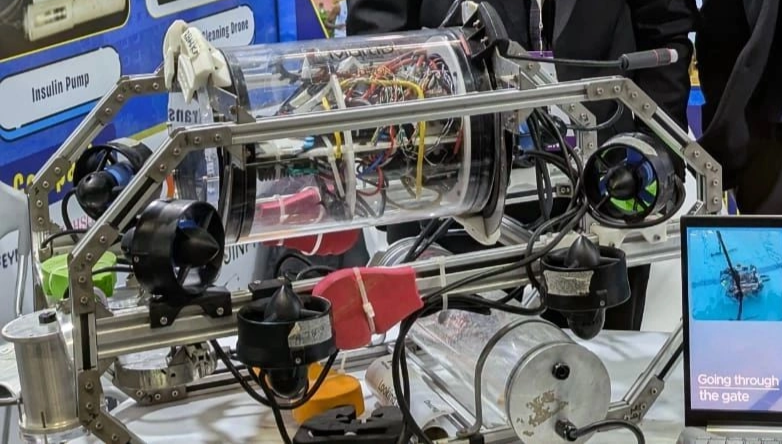

Mira v1 initially followed a design based on the BlueROV2 Heavy design and it was reliable and gave us smooth 6DOF control. Wanting to improve speed and reduce bulkiness, we eventually attempted converting it into a VTC configuration.

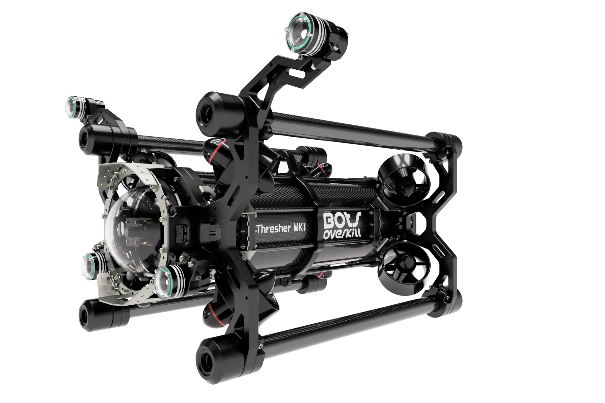

Unfortunately this didn't work out well for us. By the time we were able to get the rods and the mounts manufactured out of metal at a reasonable cost, we could not control the AUV. No matter what we did, the ArduSub controller would always apply some drift, rendering the STABILIZE mode unusable. Besides this and other issues, the configuration was generally difficult to work with, so the bot was reverted to the original BlueROV2 Heavy configuration for greater stability and an easier working environment.

### Electrical

Electrically, the configuration of our AUV never changed much. We only faced an issue when trying to implement a kill switch for the thrusters to comply with competition regulations: due to the high peak current draw from the T200 thrusters, we had to settle for a software-based kill switch.

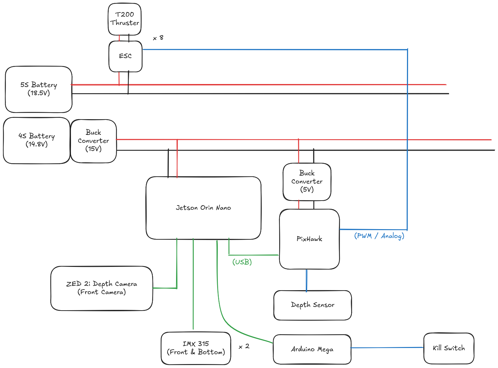

We had attempted using Solid State Relays for the kill switch, but those caused intermittent lockup issues, possibly due to the high EMF generated by the thrusters, and ultimately cost us the SAUVC competition.

### Programming

Initially the stack was a clusterfuck of random scripts that talked over ROS and was generally really fragile, so a large amount of my tenure was invested in making it more reliable and easier to work on. I Dockerized the entire stack to remove system-specific dependencies, got the cameras streaming with low latency even over less-than-ideal connections, and changed much of the internal code architecture to allow easier modification and easier hardware optimization (to take advantage of the Jetson hardware).

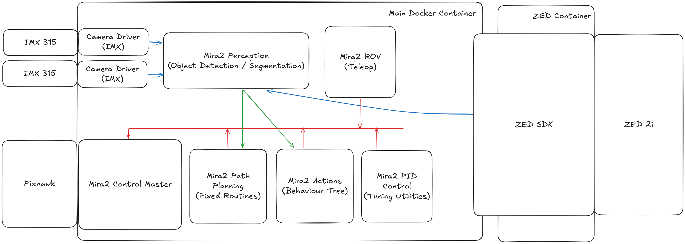

In the diagrams the arrows just show the unidirectional flow of data, since the exact data being transferred and how it was transferred were things we iterated on a lot.

Sources:
- [Dreadnought-Robotics/mira](https://github.com/Dreadnought-Robotics/mira)
- [davidnoronha1/zed-jetson](https://github.com/davidnoronha1/zed-jetson)

## Task Primer

Mostly I want to go over the various problems / difficult situations we faced and the workarounds / alternative solutions we came up with for each, but I should first do a quick primer on all the tasks in both competitions.

### SAUVC

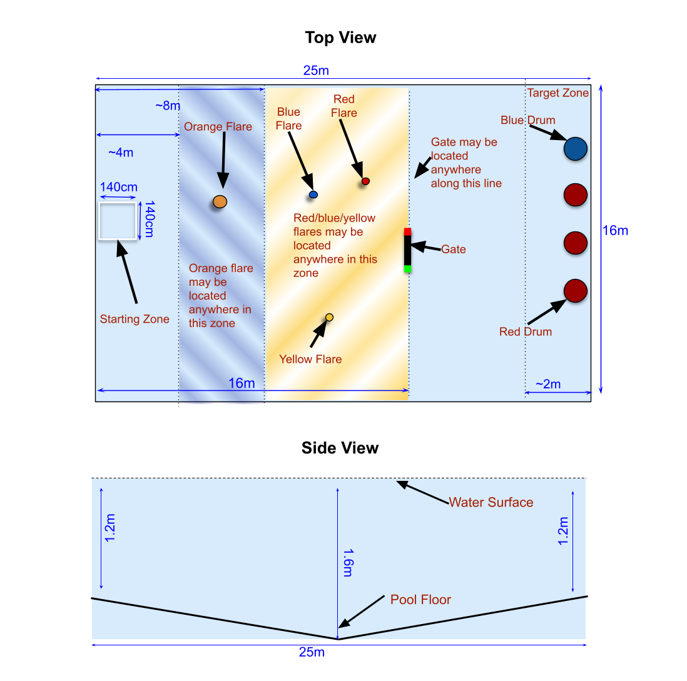

There are 4 tasks in SAUVC (labels are our own):

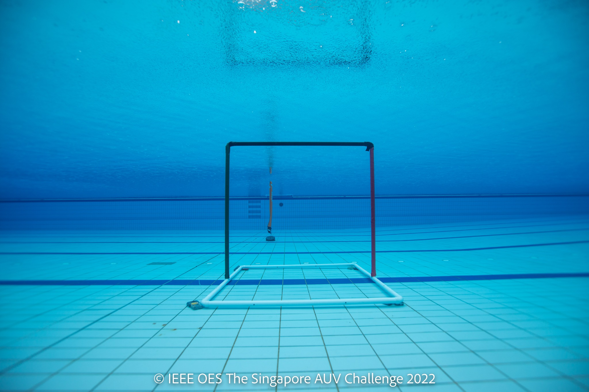
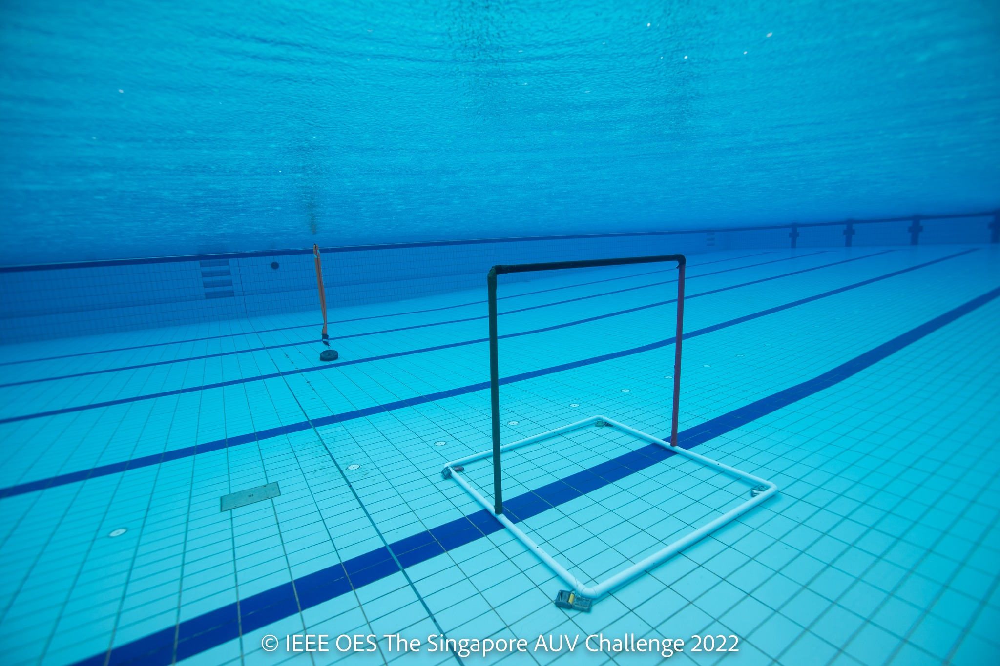

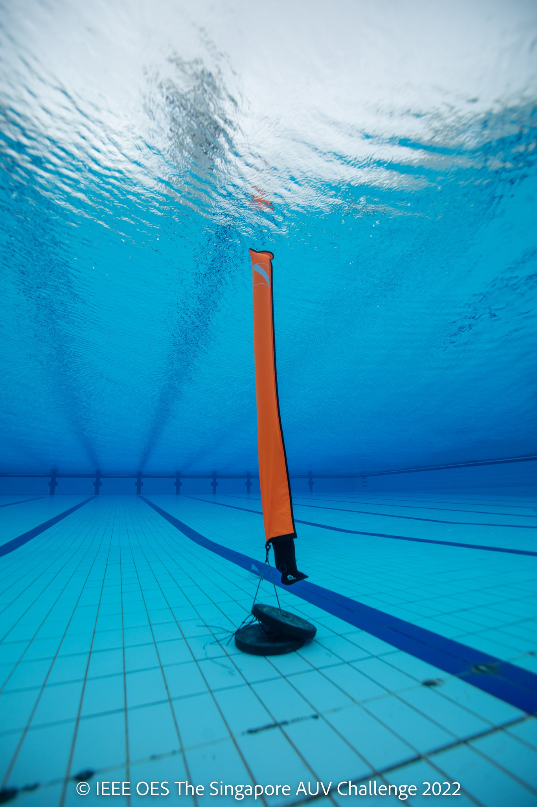

**Flare Task**

The bot must successfully avoid the orange flare that can be anywhere within the initial pool zone before the gate.

**Gate Task**

The bot must find the gate and pass through it without touching any of the gate borders.

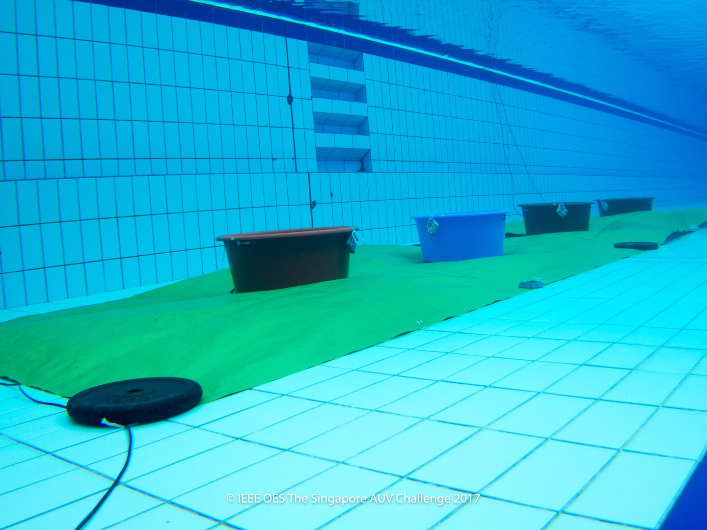

**Bucket (+Hydrophone) Task**

The bot must navigate to the buckets at the end of the pool, successfully detect the color of each of them, and then correctly place a ball within the blue bucket or, preferably, within the red bucket that has the acoustic pinger (45kHz).

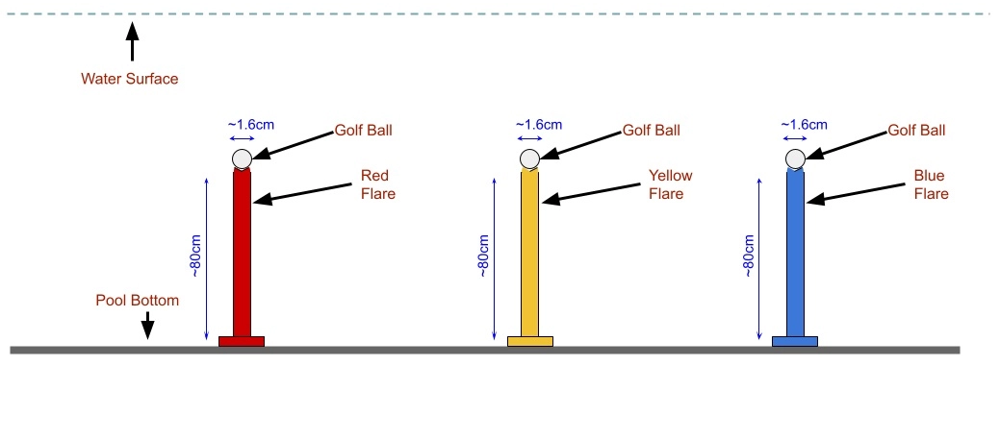

**Poles Task**

The bot must find and bump the three coloured poles (red, yellow and blue) so that the ball on each one drops. For the bonus points this must be done in a given order, which is randomized for every attempt and only told to the team after the gate, so the bot must have some kind of tetherless communication with the surface to receive it.

Source: [SAUVC Rulebook](https://sauvc.org/rulebook/)

### TAC

There are 4 tasks in TAC as well:

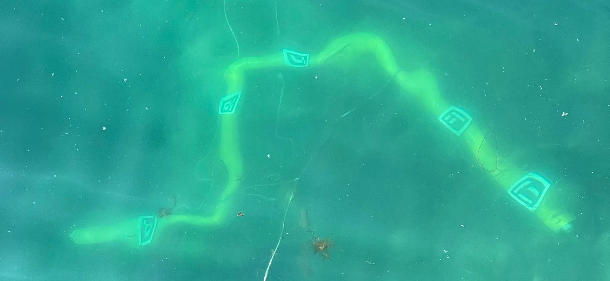

**Pipeline Task**

The pipeline (yellow, 200mm diameter, no longer than 10m, with an unknown path) is placed on the seabed with an acoustic pinger (30kHz) at its start. The bot must find the pinger, follow the pipeline and report the list of ArUco marker IDs (4-10 of them) in the order they appear from the pinger end. For a full point run the bot must *autonomously* locate the pipeline, track it, detect the markers and return to the launch and recovery site.

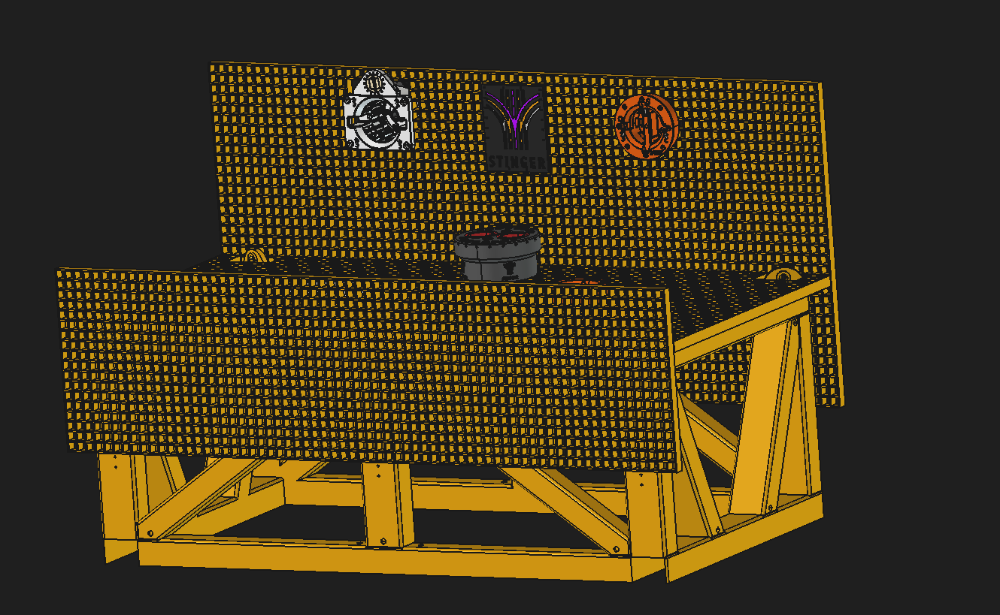

**Underwater Structure Task**

The bot must find the underwater structure on the seabed and inspect it by identifying the 5-10 ArUco markers positioned all over it (some harder to see than others) and report them as a list of marker IDs. This task and the valve task are performed in the same run.

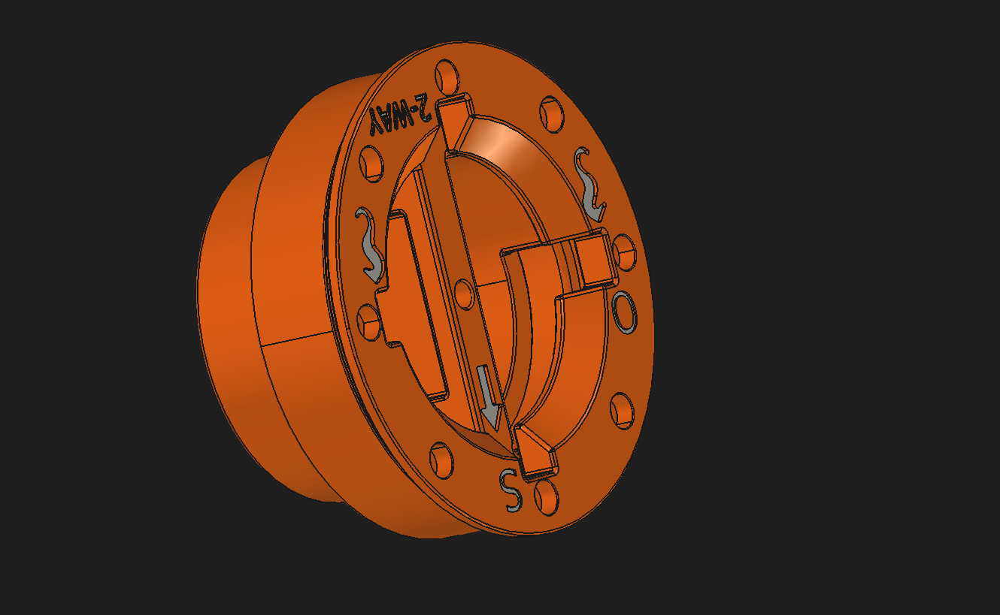

**Valve Task**

There are two valves on the underwater structure, one on the vertical surface and one on the horizontal surface. The bot must autonomously find each valve, properly align itself and its gripper and rotate the handle through its 90 degree range to the shut (S) or open (O) position given by the judges before the run. The starting position of the handle is not guaranteed.

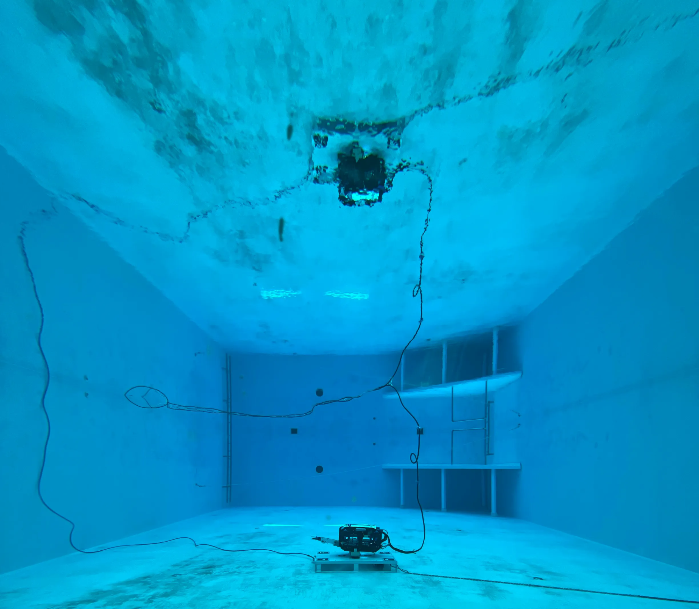

**Docking Task**

The docking station sits on the bottom of an indoor training pool. The bot must find it and autonomously dock on the indicated landing area and stay there for at least 10 seconds, docking precisely enough that the inductive power pucks make contact, and demonstrate power transfer using a light that is powered only by the secondary puck.

Source: [TAC Rulebook](https://tacchallenge.com/wp-content/uploads/2024/02/Rules-and-Regulations-2024-rev.1.pdf)

## Task Solutions / Software

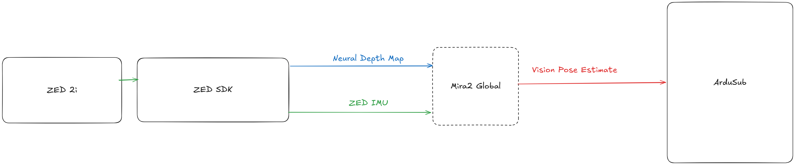

### SAUVC

This may not be the best way to approach the tasks, but it was my train of thought when trying to think of the cleanest way to solve them. Most of the tasks involve finding out **where** objects are in your scene and **what** objects those are so essentially you need to have a good map of your surroundings and know your own location within this map, so you can *very easily* navigate to known waypoints in the environment and aren’t relying on dead reckoning from the IMUs for your own position within the map. So essentially the AUV needs to function as a SLAM (simultaneous localization and mapping) bot.

Doing this underwater is kind of a struggle. In air, this can be done fairly easily with LiDAR, but this doesn’t work underwater (the light waves scatter too quickly). So essentially your options for *mapping* are limited to side-scan sonar and depth cameras. Due to the prohibitive cost of side-scan sonars, we decided to experiment with a ZED 2i stereo depth camera.

The plan is to use this with its ZED SDK to get the clean Neural Depth and then feed this to ArduPilot as an external pose estimate. We can also fuse this with the IMUs from the camera and the Pixhawk to have a clean self-pose within the map.

Once ardusub had the local map we could easily use *GUIDED* mode to navigate us to different waypoints locations around the competition arena and also handle things like collision avoidance.

Using the bounding box of any detected object, we can take the points that lie within that bounding box to be the points of the object itself so we can then use the pose from those points, using the pose we can easily target that object during navigation.

Initially all our task solutions were written as a single routine script, we have since started moving towards representing every task as a behaviour tree, this lets us *very easily* re-use components / primitives across multiple tasks like GoToBoundingBox, AngularSweep etc.

### TAC

Many of the same things are useful here as well, though for this competition instead of a generic approach that worked for most of the tasks, we had to focus on custom CV routines for each task since the water environment could vary a lot and if it was muddy / dirty would kind of ruin the stereo depth.

Generally for both competitions, we trained YOLOv11 models (so they were small enough to run on the jetson orin nano) to take care of object detection, we also spent a lot of time trying to get FoundationPose and DOPE working but we didnt have access to the hardware to run Foundation Pose and DOPE we faced issues importing custom objects easily and rendering the scenes to train it was also problematic.

I genuinely still dont have a great idea of how you would attempt the subsea structure task fully autonomously.

## Challenges

This section is going to be very subjective 🙂

### Lack of University Support

This is going to be a rant but it really was the sort of source of most of our problems, for one thing VIT university has a very strict 75% attendance policy and you only get an exception if your CGPA is &ge;9.0/10.0, This if you can imagine is quite… detrimental for club work that must be fit within this busy schedule of classes, assignments and if you attend placements then placement pre-placement talk etc. So despite us technically having “2 weeks” for a competition, it comes out to more like 12hrs per person or even less.

Also since our university makes it very difficult to leave the campus for hostellers (you need to apply for a leave before hand and that needs to be approved with a mail from your parents and that also only *if* your proctor decides to allow it) so we pretty much only had access to the campus swimming pool which is open to people pretty much from 7am till 6:30pm so we could only either go very early morning for a couple hours (6:30am till 7am) and from 6:30pm till 8:30 so usually only the evening testing would happen and even then many people aren’t able to attend due to conflicting time tables.

So we are stuck with having very few man hours and very little pool testing time, this sort of forced us into a workflow of often going to a pool testing even without much to test simply to “not waste” the pool time.

And due to the limited time, our best option was to typically record data / datasets and then work on these at home which is fine but we then struggled to get the right kind of data and to verify / reproduce any work / results we derived from data we collected maybe a week ago.

### Mechanical Instability

My batch was very ambitious when we entered so we often came up with things to try in order to improve the bot and we also decided to switch to [VTC](#mechanical) so throughout our tenure there was always something either broken or being worked on mechanically on the bot.

This while fine on its own presents a problem, our bot utilizes a cascaded PID control for depth yaw and pitch, we could offload this entirely to the ardusub but we kept having issues with depth hold and stabilize mode, granted we didnt spend a lot of time trying to debug these issues (ardusub is really a pain to debug) but they happened consistently enough that we resorted to the basic PIDs for the autonomous routines,

This is fine on its own the problem is that we need to manually tune the PID coefficients whenever something on the bot changes a lot like if weight is removed shifted or added so the end result was that for a majority of the time, the bot was either not in a state to be used, or if it was we had to retune it before we could get data back.

### Pool Cloudiness

This is kind of a very specific complaint but for all our competitions, the water environment is very clear visually, so you can see to a far distance.

#VIDEO /assets/videos/mira-cloudy-pool.webm
#END VIDEO

Meanwhile this is what we were dealing with…, this is due to a combination of factors, bad lighting conditions in pool itself (it was best only during early morning with sunlight) and the chlorine / cleaning chemical they used that always clouded up the water visually. Meanwhile the SAUVC pools looked like [this](#sauvc).

Not only did this cause **all** our perception problems to become much harder, it also meant we couldnt adapt any scripts from this “badpool” to a “goodpool” and essentially would have to retrain everything based on the *very* *very* limited amount of photos and videos that we had from SAUVC.

## Solutions

### Simulator

So considering our limited pool testing time and the state of the pool itself, We decided to focus our efforts on developing an accurate enough simulator for these tasks so that routines and perception codes could be tested without the need of the pool and once things were working within simulator, we could invest time purely in bridging the sim2real gap.

So after surveying the fairly *sparse* environment of underwater capable simulators, we ended up with 2 options that were feasible under our hardware constraints (best case: a laptop with a 4050, worst case: an old thinkpad with bad integrated graphics):

- Gazebo with Bouyancy and systems from project DAVE
- Stonefish

Initially we decided on Stonefish since it was more dedicated for underwater work and had good visuals which was good for perception but despite a long time of trying to get it to work on everyone’s machines, we found that it was just too unstable on many systems and otherwise was very slow.

We also needed to maintain a bridge between stonefish &harr; ardupilot that went through ROS and introduced a mess of coordinate systems since stonefish, ros and ardupilot all use different coordinate systems. One major point of contention was we could never get the ardupilot depth hold to work.

Eventually we thought to experiment with gazebo (this was the time when claude etc got competent) and that had much better results and was also easier to setup since there was more support for it online, eventually we were able to build it out to have our entire competition arenas for both SAUVC and TAC and to test out new ideas we had.

This is the depth map based SLAM navigation we wanted to do for SAUVC / TAC:

#VIDEO /assets/videos/mira-slam-sim.webm
#END VIDEO

Source: [mira_sim](https://github.com/davidnoronha1/mira_sim)

We even tried getting access to some of our universities GPU machines to run Issac Sim with OceanSim to get really nice artificial data for our competition environments but the process to get access to lab resources for a student (ie: not a PHD student) is incredibly painful so after 2 months of trying, we kind of gave up since it was too much work and we didn’t have hardware that could run IssacSim comfortably.

### Differential Pressure Speed Sensor (DPSS)

We spent a lot of time researching solutions to our localization & mapping issue, one of things we did was get a ZED 2i stereo camera and the other thing was to create a DPSS based on some papers we have, on a very high level:

We take pressure at 3 points of a hemisphere and compute the difference between the pressure at the extreme points and the center point which is at the zero velocity point (stagnation point), then using some math based on Bernoulli’s principle (the relation of pressure to velocity), we can find the bot’s velocity very accurately in one direction.

So this can help us the localize since it can be combined with the IMU for angular changes (rotation).

I know the explanation isn’t very good, I got lazy, read the papers if you want the exact physics of it.

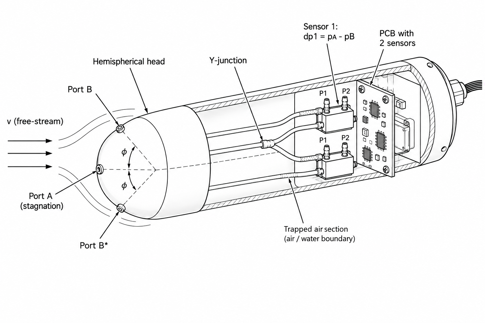

Sources:

1. **Fuentes-Pérez, Meurer, Tuhtan, Kruusmaa**, “Differential Pressure Sensors for Underwater Speedometry in Variable Velocity and Acceleration Conditions.” IEEE Journal of Oceanic Engineering (2018) Vol. 43, 2, p. 418-426.[https://doi.org/10.1109/JOE.2017.2767786](https://doi.org/10.1109/JOE.2017.2767786) [ttu](https://ws.lib.ttu.ee/digibase/en/Publ/Register/Item/155294)
2. **Meurer et al.**, “Differential Pressure Sensor Speedometer for Autonomous Underwater Vehicle Velocity Estimation.” IEEE Journal of Oceanic Engineering.[https://doi.org/10.1109/JOE.2019.2907822](https://doi.org/10.1109/JOE.2019.2907822) [ttu](https://ws.lib.ttu.ee/publikatsioonid/en/Publ/Register/Item/142171)
3. **Meurer, Fuentes-Pérez, Schwarzwälder, Ludvigsen, Sørensen, Kruusmaa**, “2D Estimation of Velocity Relative to Water and Tidal Currents Based on Differential Pressure for Autonomous Underwater Vehicles.” IEEE Robotics and Automation Letters (2020) vol. 5, 2, p. 3444−3451. This paper presents the DPSSv2, a low-cost, lightweight and energy efficient sensor to estimate fluid relative velocity in 2D based on differential pressure, validated in field trials on-board an AUV in the presence of tidal currents.[https://doi.org/10.1109/LRA.2020.2976318](https://doi.org/10.1109/LRA.2020.2976318)

<aside>
💡

Work In Progress

</aside>

[Excalidraw Whiteboard](https://excalidraw.com/#json=RUzJmOxhKQD105-lvm3aR,IUyTBoduecWU85e1ujW5DQ)
