#HEADER Robotic Arm System Design
Latency Transport & Controls Planning for a 6DOF Robotic Arm
#END HEADER

This is based on a interview assignment I did for Origin Robotics, (no reply :< ) — here is [my original handwritten version](/assets/documents/origin-assignment.pdf), with the [cleaned up version in Word](/assets/documents/origin-assignment-clean.pdf) as well. The whole writeup is reproduced below.

I later got to work on a SO-101 arm for Reinforcement Learning training while at Muks Robotics

#VIDEO /assets/videos/NC_20260805_103007.webm alt=teleop demo with SO101 arms
#END VIDEO

<hr>

<div style="text-align: center; margin: 2.5em 0 1.5em 0;">
  <h2 style="margin-bottom: 0.25em;">Embedded Software &amp; Controls Assignment</h2>
  <p style="margin-top: 0; font-size: 1.05em;">David Noronha &mdash; <a href="mailto:davidnoronha@outlook.in">davidnoronha@outlook.in</a></p>
</div>

### Initial Conditions

#TABLE	.table-full	.initial-conditions
**Jetson AGX Orin**	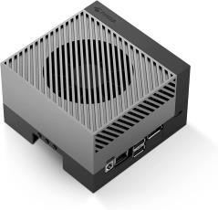	[Datasheet](https://www.mouser.com/datasheet/2/744/Seeed_Studio_06132023_102110758-3216382.pdf)
**Livox Mid 360 Lidar**	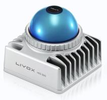	[Datasheet](https://terra-1-g.djicdn.com/851d20f7b9f64838a34cd02351370894/Livox/Livox_Mid-360_User_Manual_EN.pdf)
**ECon Systems<br/>STURDeCAM25**	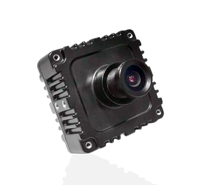	[Datasheet](https://vitacin-my.sharepoint.com/:b:/g/personal/david_john2023_vitstudent_ac_in/IQB3ZBRFHI8rRbj82wDRcqg8ASJgORB96lVxFGKwQTOPHis?e=rVLf0M)
**Universal Robots UR7e**	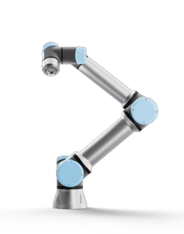	[Datasheet](https://www.universal-robots.com/manuals/EN/TechSheets/UR7e_techsheet_pdf_online/UR7e_techsheet_en.pdf)
#END TABLE

## Data Pipeline

### Vision

<figure>
  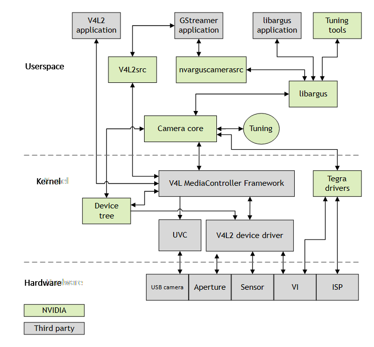
  <figcaption>Kernel / Userspace drivers for camera in Jetson – <a href="https://docs.nvidia.com/jetson/archives/r38.2/DeveloperGuide/SD/CameraDevelopment/SensorSoftwareDriverProgramming.html">Jetson Developer Guide</a></figcaption>
</figure>

<figure>
  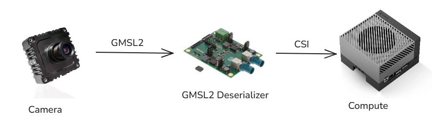
  <figcaption>Camera pipeline in hardware</figcaption>
</figure>

<figure>
  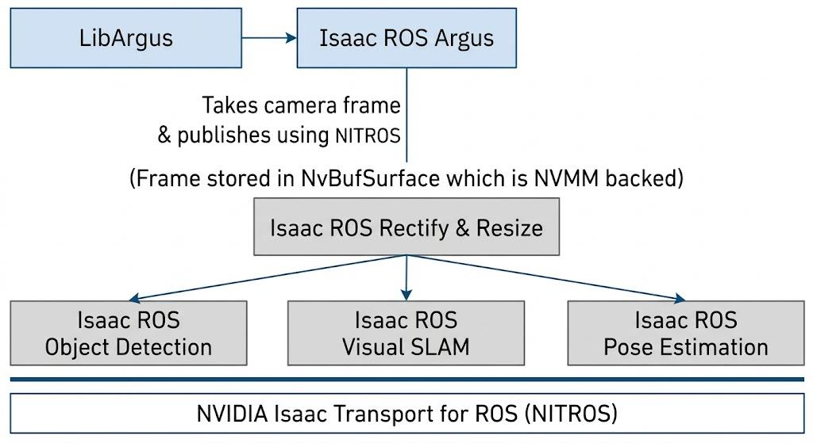
</figure>

NITROS ([NVIDIA Isaac Transport for ROS](https://nvidia-isaac-ros.github.io/v/release-3.2/concepts/nitros/index.html)) nodes that are next to each other in a graph, they apply type negotiation & type adaption which removes memory copies.
Over ROS each node simply publishes a small header w/ the location to the message/data in GPU memory
Location internally contains GPU side pointers / NvBufSurface internally backed by NVMM
Also need to compose the nodes using `component_container_mt` to ensure intra process communication.
Since if you need to do interprocess communication, you need to use DDS/RMW which brings copies.

[Isaac ROS Documentation](https://nvidia-isaac-ros.github.io/v/release-3.2/index.html)

### Point Cloud

Similar flow only, using NITROS to enable zero copy transfer across our stack.

<figure>
  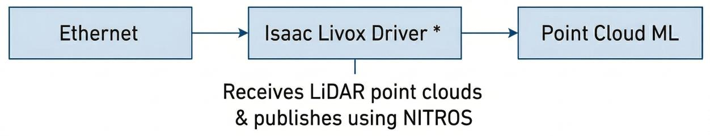
</figure>

There exists no Isaac ROS Livox Driver so a custom one utilizing [GXF](https://docs.nvidia.com/holoscan/sdk-user-guide/gxf/doc/index.html) & the base [Livox SDK](https://github.com/Livox-SDK/Livox-SDK2) would have to be made.
We can either make a bridge node that consumes the PointCloud message & republishes into NITROS or modify the Livox Driver to work similarly to Isaac ROS [Nvblox](https://github.com/nvidia-isaac/nvblox) / [Isaac ROS Hesai](https://github.com/NVIDIA-ISAAC-ROS/isaac_ros_nova/tree/main/isaac_ros_hesai) which is a NITROS accelerated driver for the Hesai LIDAR.

But this only makes sense if our computation using the pointcloud is GPU accel. & can make use of the data being available in the GPU to reduce copies.
If the processing is mostly CPU bound then ROS2 intra process communication (sharing memory within process) should be sufficient.

## Notes

- Modern Isaac ROS for the Jetson host, recommends Nvidia SIPL for the camera but doesn't seem to be stable / reliable for the Orin, using older version of Isaac ROS (v3.3)
- If using ROS, a 1080p raw image at 65 f/s is:
    1920 × 1080 × 3 × 65 bytes/s ⇒ 404.352 Megabytes/s
    This data is copied multiple times during serialization & deserialization.
    This eats up memory bandwidth.
- The TensorRT inference node can automatically use the NITROS image handles w/o any copies, removing need for copy from host to device.
- Can run inference on the Jetson's DLA to offload processing from the GPU.
- In the LIDAR driver, could use remote DMA if available to directly write the received sensor data to the Orin's memory (accessible by the CPU & GPU).
- Can test with using Cyclone DDS with shared memory to reduce latency in the pipeline, especially between 2 regular ROS nodes.

## System Architecture / Synchronization

<figure>
  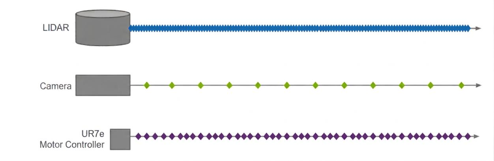
  <figcaption>All devices functioning at different clock speeds, Continuous, 30Hz, 500Hz</figcaption>
</figure>

Using the Orin's Timestamp Clock (TSC) as the reference to all other clocks, we can synchronize the LIDAR & Camera timestamps to the TSC and can estimate the drift between the motor controller clock and synchronized TSC clock, We can also propagate this clock to the network using PTP (Precision Time Protocol) which is responsible for synchronizing any connected ethernet devices using the following logic:

<figure>
  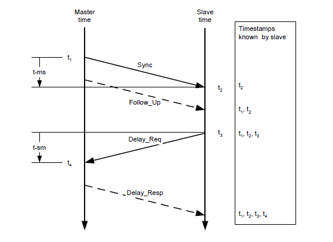
</figure>
⠀

```math
D = \frac{(t_4 - t_1) - (t_3 - t_2)}{2} \qquad O = (t_2 - t_1) - D
```

Where D is the transmission delay between the slave & master clock and O is the clock offset

Using ptp4l, we can configure the Jetson to be the grandmaster & synchronize the LIDAR to its own clock & other PTP slaves.

Taking advantage of Jetson hardware features, it has a feature to sync the PTP clock with the TSC using PPS from the network card.

This is very useful for applications like this one (sensor fusion & camera frame timestamping).

The Orin also includes the Generic Timestamp Engine, which provides hardware timestamping for state changes of specific interrupt lines.

This is used by LibArgus (the Linux API for cameras on Tegra) to obtain SOF / EOF timestamps that are synchronized to TSC.

In this way, all the sensors are synchronized to the same clock domain.

Alternatively, you could trigger camera frames using FSYNC / PPS based on the TSC clock, but you must handle finite timeouts in the Argus driver & connect to the Jetson's GPIO pins.*

*I couldn't find good documentation for the e-con camera, so I'm just going over keywords I've found.*

#TABLE	.table-full	Device	Clock	Method	Accuracy
**Jetson**	TSC / PTP grandmaster	phc2sys	reference
**Livox Mid-360**	PTP slave	[Native PTP client](https://livox-wiki-en.readthedocs.io/en/latest/tutorials/new_product/common/time_sync.html)	±500ns
**STURDeCAM25**	TSC	[LibArgus Hardware Timestamps](https://docs.nvidia.com/jetson/l4t-multimedia/classArgus_1_1Ext_1_1ISensorTimestampTsc.html)	&lt;10µs
**UR7e joints**	UR internal clock	RTDE round-trip correlation + drift tracking	~1ms
#END TABLE

- [Orin Time Sync | NVIDIA Docs](https://developer.nvidia.com/docs/drive/drive-os/6.0.8/public/drive-os-linux-sdk/common/topics/network_stub/time_sync_details.html)
- [Generic Timestamp Engine — Jetson Linux Developer Guide documentation](https://docs.nvidia.com/jetson/archives/r35.2.1/DeveloperGuide/text/SD/Kernel/GenericTimestampEngine.html)

## Clock Synchronization Architecture

<figure>
  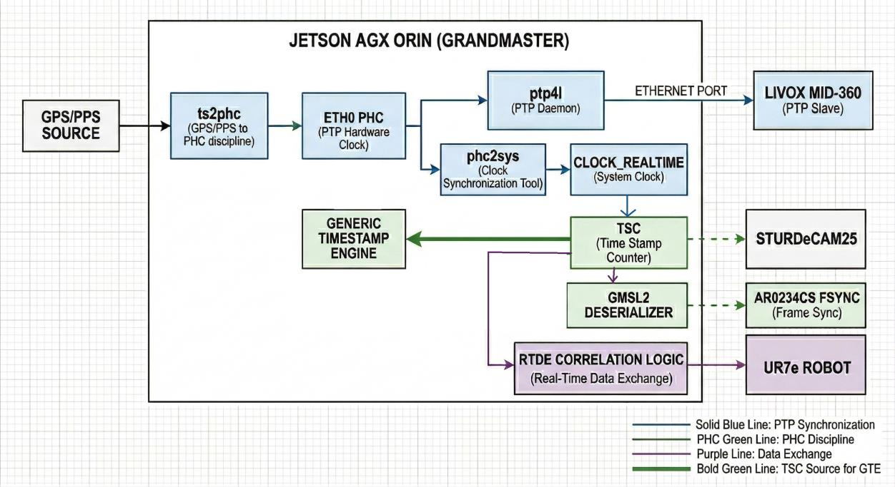
  <figcaption>Clock Synchronization Architecture</figcaption>
</figure>

### UR7e Motor Controller (RTDE)

The UR7e uses its own clock that I can't figure out how to synchronize, so what I'd compromise with is taking the timestamp from RTDE & using that to convert time from the robot to PTP time domain & vice versa, kind of like this:

```
t1 = getTime
ur = RTDETime
t2 = getTime

# Assume RTDE timestamp taken at (t1 + t2) / 2 = e

offset = (e / 1e9) - ur
          └── convert from ns to s
```

You can use a no-lock ring buffer to store history of the UR7e joint states so you can remember the joint state from when a particular image frame was taken, & since the controller can respond faster than the camera. Otherwise, if a state is not discretely stored, you can interpolate from the 2 nearest states.

Occasionally you'll have to re-run this "manual" synchronization.

## Camera Hardware Synchronization

**Finding camera time offset**

```python
t1 = SystemTime()
tc = getCameraFrame().ts # → Get the next available camera frame
t2 = SystemTime()

offset = ((t1 + t2) / 2) - tc
```

**Delay compensating trigger generator**

```cpp
ts = offset / 1e3 ; nTs = 1e3

while (true) {
    emitPulse(FSYNC_PIN);
    period += ts * (nTs--);
    sleep(period);
}
```

Very rough idea to spread out the offset over 1000 frames (@ ~16 s at 30 fps), assuming the camera clocks have some clock drift in a few minutes.

## Compute Resource Monitoring

### System Health Struct

```cpp
struct SystemHealth {

    // ── Timing & Synchronization
    int64_t   lidar_ptp_offset_ns;     // from ptp4l — target: < 500'000 ns
    int64_t   camera_tsc_corr_error_ns;// from correlated_timestamp_driver
    int64_t   ur_clock_drift_ppm;      // from URClockTracker
    uint64_t  last_trigger_jitter_ns;  // actual vs intended FSYNC fire time
    uint32_t  camera_frames_dropped;   // rolling 1s window
    uint32_t  lidar_packets_missed;    // rolling 1s window

    // ── AI Inference
    float     inference_latency_ms;    // latest TensorRT forward pass
    float     inference_latency_p99_ms;// 99th percentile over 10s window
    uint32_t  trajectory_buffer_depth;// waypoints ahead of current time
                                       // < 3 = AI struggling
    uint64_t  last_ai_trajectory_ns;   // age of most recent trajectory
    bool      ai_timeout;              // set if > 80ms since last trajectory

    // ── Control Loop
    float     control_loop_jitter_us;  // 500Hz loop period deviation
    uint32_t  rtde_write_failures;     // failed RTDE packets (rolling 1s)
    bool      deceleration_active;     // true = AI timeout engaged

    // ── Thermal & Power
    float     gpu_temp_celsius;
    float     cpu_temp_celsius;
    float     gpu_power_watts;
    uint32_t  gpu_throttle_events;    // non-zero = thermal throttle occurred

    // ── Robot Safety
    bool      estop_engaged;
    float     tcp_velocity_m_s;        // must remain < safety_limit
    float     joint_torque_max_nm;     // highest torque across all joints
    bool      protective_stop_active;  // UR internal safety violation

    // ── System-Level
    float     cpu_load_1s[12];         // per-core load
    uint64_t  core2_max_latency_ns;    // worst RT wakeup latency on isolcpus
    uint32_t  watchdog_misses;         // health monitor heartbeat misses

    // ── Derived Status
    enum class Status { GREEN, YELLOW, RED, ESTOP } overall_status;
};
```

### Action Matrix

#TABLE	.table-prose	.action-matrix	Fault Condition	Severity	Action / Mitigation Strategy
**Camera Frame Dropped**	Warning	Log Event. Tag current frame as STALE. Use last valid frame with dead reckoning estimation for 1 cycle. Increment drop counter. If counter ≥ 3, escalate to Error. Pause Inference. Alert mission planner.
**Lidar PTP Offset > 5ms**	Error	Reject incoming point cloud; Attempt PTP re-sync. Pause trajectory updater. If not resolved in 2s, escalate to CRITICAL & command robot to [stop].
**Inference Latency > 100ms**	Critical	Immediately freeze trajectory buffer at current waypoint. Engage deceleration trajectory toward safe park pose. Wait for Clear Fault before resuming.
**GPU Temp > 85°C**	Critical	Reduce GPU clock to min. power state. Drop inference to 10Hz fallback mode (from skip). Command robot to request safe park pose. Wait till temp < 75°C for 30s.
#END TABLE

## Core Control Logic

<figure>
  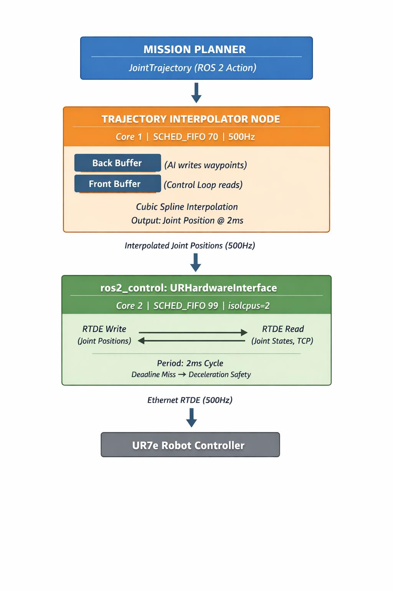
</figure>

### Trajectory Estimation Pseudocode

```python
MAX_WAYPOINTS = 64
front = []
back = []
f_c = 0
b_c = 0

atomic<bool> new_trajectory_ready = false;
atomic<uint64> last_ai_update_ns = 0;


def pus(waypts):
    b_c = min(len(waypts), MAX_WPTS)
    back = [...waypts[0:b_c]]
    last_ai_update_ns = now();
    new_trajectory_ready = True;


# Called by controller loop
def maybe_swap():
    if (new_trajectory_ready == False):
        swap(front, back);
        f_c = b_c


def interpolate_at(ts):
    for i in range(0, f_c):
        if front[i].ts <= ts && front[i+1].ts >= ts:
            α = (ts - front[i].ts) / (front[i+1].ts - front[i].ts)
            return lerp(front[i], front[i+1], α)

    return front[f_c+1]
```

Very basic interpolation, for longer time periods, could use an Extended Kalman Filter that handles non linear data.

### Core Allocation

#TABLE	.table-prose	.core-allocation	Core(s)	Task / Responsibility	Priority	Scheduling Policy
0	Linux OS, ROS 2 middleware, logging, non-RT housekeeping	Default	SCHED_OTHER
1	Lidar driver (UDP rx), Camera driver (GMSL2/Argus), PTP trigger thread (30Hz FSYNC)	70–80	SCHED_FIFO
2	**500Hz RTDE Control Loop, URHardwareInterface plugin**<br/>*(ISOLATED — isolcpus=2)*	99	SCHED_FIFO
3	Health monitor watchdog, UR clock drift tracker, Trajectory buffer manager	50–60	SCHED_FIFO
4–7	ROS 2 executor threads, Mission planner, API services, Correlated timestamp driver	Default	SCHED_OTHER
8–11	TensorRT inference (CPU side), Point cloud preprocessing, nvblox / scene reconstruction	Default	SCHED_OTHER
#END TABLE

- GPU (CUDA Cores): TensorRT inference graph, point cloud voxelization
- GPU (DLA Core 0): Primary TensorRT engine (routed via Isaac ROS)
- GPU (DLA Core 1): Fallback / secondary model
- Kernel boot params: `isolcpus=2 nohz_full=2 rcu_nocbs=2`
- RT thread startup: `mlockall(MCL_CURRENT | MCL_FUTURE)` + stack prefault

## Robot Arm Interface

### Actions

#TABLE	.table-prose	Action Name	Goal (Inputs)	Feedback (Progress)	Result (Final Output)
**TriggerScan**	quality_level (0-2)<br/>require_lidar (bool)	percent_complete<br/>stage (MOVING, etc.)	point_cloud, frame tcp_pose_at_capture<br/>confidence, timestamp<br/>success, failure_reason
**ExecuteTrajectory**	trajectory<br/>max_velocity_scale<br/>safety_mode (0-2)	percent_complete<br/>tcp_velocity_m_s	success, failure_reason<br/>final_joint_state
#END TABLE

### Services

#TABLE	.table-prose	Service Name	Request Parameters	Response Fields
**GetSystemHealth**	*(None)*	health, ready_for_command<br/>active_faults
**RequestEStop**	reason (string)	acknowledged (bool)<br/>robot_state (0-2)
**ClearEStop**	cleared_by (string)	acknowledged (bool)<br/>robot_state (0-2)
#END TABLE

### Safety Handshake

<figure>
  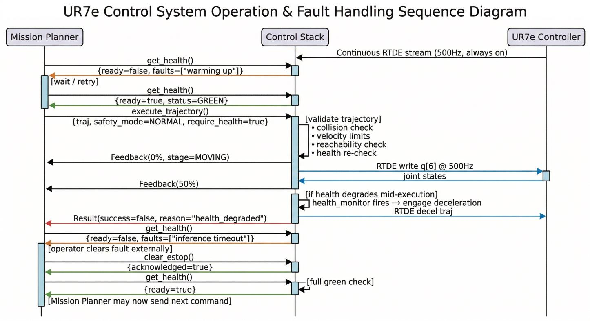
</figure>
