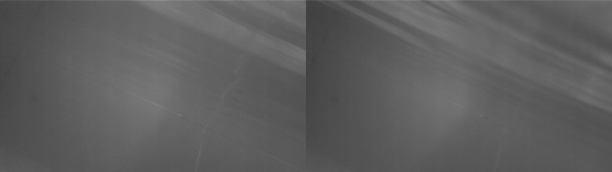
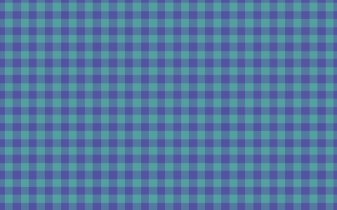
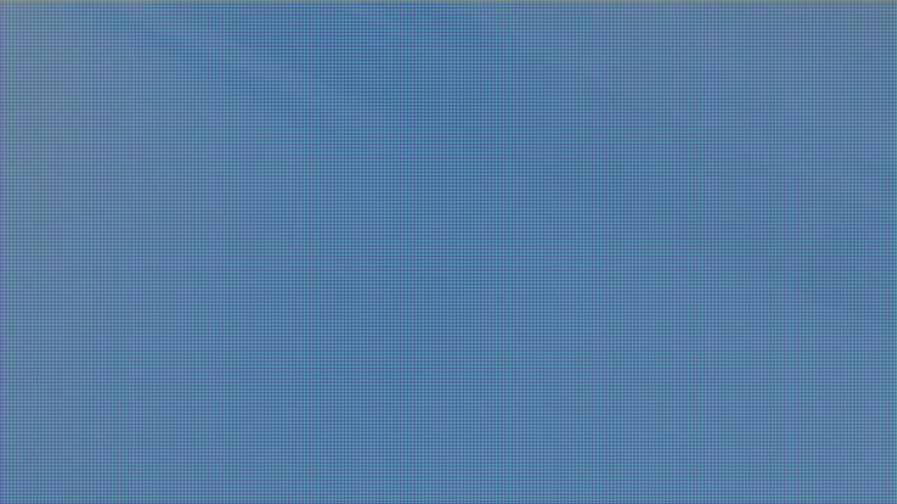
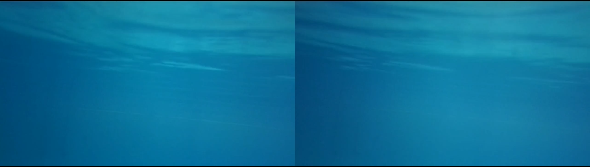

#HEADER Reverse-enginnering SVO2
The recording format from Stereolabs ZED cameras
#END HEADER

Dreadnought Robotics, The team I'm part of recently got our hands on a very nice ZED 2i stereo depth camera, However the SDK is heavily dependent on CUDA so that it made difficult for some of us and some of our infra. to make full use of it, To slightly remedy this deficiency I tried reverse enginnering the SVO2 recording format so that we could more easily export it to other formats for ingestion

[Demo File](https://vitacin-my.sharepoint.com/:u:/g/personal/david_john2023_vitstudent_ac_in/IQDa5IhGAGvCQJqSVbA8MtIXAQz2elW0FqXzF5e5PeemaaY?e=d80Ncn)
[Format Description from Stereolabs](https://www.stereolabs.com/docs/video/recording)

## First Steps
Initially I thought it might be a zip / tar archive, examination with `file` gave
```
HD720_SN38486288_18-52-52.mcap: dBase IV DBT, block length 4608, next free block index 1094929801, next free block 1131114360, next used block 810365233
```
Which is apparently some like really old [database table file format](https://www.independent-software.com/dbase-dbf-dbt-file-format.html), so since I was pretty sure that was wrong, I pulled out xxd and hoped I would have clues in the file header

```
00000000: 894d 4341 5030 0d0a 011a 0000 0000 0000  .MCAP0..........
00000010: 0000 0000 0012 0000 006c 6962 6d63 6170  .........libmcap
00000020: 2073 7465 7265 6f6c 6162 7306 b75c 0000   stereolabs..\..
00000030: 0000 0000 f900 a68d 58e5 9218 0a71 30d7  ........X....q0.
00000040: 58e5 9218 8f5c 0000 0000 0000 6e55 93f5  X....\......nU..
00000050: 0000 0000 8f5c 0000 0000 0000 031b 0100  .....\..........
00000060: 0000 0000                                ....
```

Which after triggering some vague memories of the ROS2 bag format, led me to the [MCAP file format](https://mcap.dev/guides) for storing recordings of messages and topics that's used in ROS2 bag recordings.

After dumping out whatever information I could from the bag, I was able to figure out this much

$mcap info FILE
```
channels:
        (1) svo_header                                1 msgs                      : sl_type [jsonschema]                              
        (2) Camera_SN38486288/side_by_side          762 msgs (14.64..14.66Hz)     : Camera_SN38486288/side_by_side [zed_sdk_encoded]  
        (3) Camera_SN38486288/sensors             16049 msgs (308.83..308.85Hz)   : sensors [jsonschema]                              
        (4) Camera_SN38486288/integrated_sensors    762 msgs (14.64..14.66Hz)     : sensors [jsonschema]                              
        (5) svo_footer                                1 msgs                      : sl_type [jsonschema]       
```
On further examination & dumping the schema, the header contains the resolution of the camera images and a few other details,
```json
"header_decoded": {
      "width": 1280,
      "height": 720,
      "serial_number": 38486288,
      "unknown_0x0c": 15,
      "pixel_format": 2,
      "strip_count": 4
    }
```

the footer contains the timestamps of the frames / messages and sensors and integrated sensors both contain the IMU data from the camera

The sensor data is also stored in a binary format but I didn't spend too long trying to recover it since the main thing for me was getting out the images which were stored in Camera_SN*/side_by_side

## Recovering images
Dumping the messages in that topic to individual files gives files like [this](https://vitacin-my.sharepoint.com/:u:/g/personal/david_john2023_vitstudent_ac_in/IQD91KCBs-92TJDEP4HnuoGCARLxevOl27extjDVhuRujSg?e=HgeP9b)

Which on inspection with `binwalk` & `xxd` seems to contain a 40byte header followed by exactly 4 JFIF images with no padding inbetween, Each image has the following metadata:
```
ExifTool Version Number         : 12.76
File Name                       : 66D8D
Directory                       : .
File Size                       : 411 kB
File Modification Date/Time     : 2026:02:18 23:54:55+05:30
File Access Date/Time           : 2026:02:18 23:55:57+05:30
File Inode Change Date/Time     : 2026:02:18 23:54:55+05:30
File Permissions                : -rw-rw-r--
File Type                       : JPEG
File Type Extension             : jpg
MIME Type                       : image/jpeg
JFIF Version                    : 1.01
Resolution Unit                 : None
X Resolution                    : 1
Y Resolution                    : 1
Image Width                     : 5120
Image Height                    : 180
Encoding Process                : Baseline DCT, Huffman coding
Bits Per Sample                 : 8
Color Components                : 1
Image Size                      : 5120x180
Megapixels                      : 0.922
```

At this point I had a feeling that it was going a bit too easy so far and I was to be proven right, After extracing the JFIFs, The images look like this


At this point I realized this project wasn't gonna be as easy as I had hoped, I didn't have any ideas at this point besides trying to reinterpret the JPEG as it being in another colourplane (the images extracted were in GRAY8 I was trying to make it YUV422 or the standard JPEG format)

### Side Quest: Binary Reverse Enginnering
[Executable](https://vitacin-my.sharepoint.com/:u:/g/personal/david_john2023_vitstudent_ac_in/IQBTy__gTPnMQI5CrqlQgEklAVUk29Z-z3CydLrVarCrV54?e=NHe5xa)


While randomly googling this to see to if anyone had tried anything / found any information regarding this, I came across [this docker container](https://hub.docker.com/r/stereolabs/svo-conversion-tool) from stereolabs which isnt linked anywhere and doesnt show up on my google results

The description says the container is meant to export MP4s out from SVO2 sans CUDA, I was quite happy on finding it thinking I wouldnt have to finish the reverse enginnering after all, But apparently it only works with H265 encded SVO2s, (SVO2s can compress images with JPEG / H264 / H265), No matter I figured it gave me an executable that I should be able to reverse enginner and scavenge for more information

After extracting out the executable, I saw that it wasn't `strip`ed which meant it would still have a decent amount of info leftover, looking through it there was a JPEGDecompresser class and it used `turbojpeg` -> Here I thought the file had the JPEG compressed in RAW mode from turbojpeg or would only be read by turbojpeg but then I figured that wouldnt be the case since its a fully valid JPEG file

Also spent a while fiddling with Ghidra and GDB hoping to figure out as the program executed but the program not actually working on the files had was a big damper

So this didnt go anywhere, but binary reverse enginnering is always fun


## No other ideas
Being completley out of ideas and kind of tired of hitting my head against it with little progress, I asked a few agents about it to just compare responses, Microsoft Copilot had no idea, ditto for Gemini but Claude suggested the JPEGs could be storing the [bayer pattern](https://en.wikipedia.org/wiki/Bayer_filter) and the 4 images had to be compared together somehow

This sounded the most likely thing I'd heard so we pursued that path, me being too lazy to sit and figure it out myself, mostly just worked to give feedback to Claude and run & inspect the scripts it gave me

After trying out a bunch of ideas with how the arrange the data to form the final 2x1280 : 720 image, we were finally able to see some kind of texture that looks about right



So we had the shape right and the size right but no luck on the colours, No matter what we did we couldn't get the colours to show up without some weird patterning




Since we had gotten somewhere partly, we went about in circles trying to figure out what kind of layering they were doing to form the bayer pattern

[YUYV422 Description](https://docs.kernel.org/userspace-api/media/v4l/pixfmt-packed-yuv.html)
I revisited the initial idea I had of it being YUV data planes in the JPEG misinterpreted as monochrome, That seems to be the final clue because soon after that we were able to write a successful decoder



In more detail -> The 4 strips of images (5120x180px) when stacked vertically give an image of the expected size 5120x720, this can then be reshaped to get the 2 channels for YUYV into 2x2560x720 which can then be given to OpenCV to get a BGR / RGB frame for encoding

⚠️ - The format can also encode data with H264/H265 which I didn't get sample files to reverse engineer, I'll update this once I get my hands on some

## Format Description
> Reverse engineered from ZED 2i recordings (SDK 5.1.2, firmware 2.0.5)

---

## Container

SVO2 files are standard **MCAP** files (a robotics data container format).
The `.svo2` extension is ZED-specific but the file is fully valid MCAP.

```
┌─────────────────────────────────────────────────────────────┐
│                        MCAP FILE                            │
│                                                             │
│  ┌──────────┐  ┌──────────────────────────────────────┐     │
│  │  Header  │  │              Chunks                  │     │
│  └──────────┘  │  ┌─────────┐ ┌─────────┐ ┌───────┐   │     │
│                │  │ Chunk 1 │ │ Chunk 2 │ │  ...  │   │     │
│  ┌──────────┐  │  └─────────┘ └─────────┘ └───────┘   │     │
│  │ Summary  │  └──────────────────────────────────────┘     │
│  │  Index   │                                               │
│  └──────────┘                                               │
└─────────────────────────────────────────────────────────────┘
```

---

## Topics / Channels

```
┌───────────────────────────────────────────────────────────────────────┐
│ Topic                                  │ Encoding      │ Rate         │
├───────────────────────────────────────────────────────────────────────┤
│ svo_header                             │ jsonschema     │ 1 msg       │
│ Camera_SN<serial>/side_by_side         │ zed_sdk_encoded│ ~15 Hz      │
│ Camera_SN<serial>/sensors              │ jsonschema     │ ~308 Hz     │
│ Camera_SN<serial>/integrated_sensors   │ jsonschema     │ ~15 Hz      │
│ svo_footer                             │ jsonschema     │ 1 msg       │
└───────────────────────────────────────────────────────────────────────┘
```

---

## svo_header

JSON message. Contains camera configuration and a base64-encoded binary
blob (`header`) with the following structure:

```
base64("header") binary layout — 128 bytes
┌────────┬────────┬────────────────┬────────────┬────────────┬──────────────┐
│  0..3  │  4..7  │     8..11      │   12..15   │   20..23   │   24..27     │
│ uint32 │ uint32 │    uint32      │   uint32   │   uint32   │   uint32     │
│ width  │ height │ serial_number  │  unknown   │ pix_format │ strip_count  │
│  1280  │  720   │   38486288     │    0x0f    │     2      │     4        │
└────────┴────────┴────────────────┴────────────┴────────────┴──────────────┘
  remaining bytes: calibration floats (IMU, lens distortion, etc.)
```

Other JSON fields:
- `ZED_SDK_version`  — e.g. `"5.1.2"`
- `version`          — SVO2 format version, e.g. `"2.0.5"`
- `IMU_frequency`    — e.g. `400.0`
- `Calib_acc`        — base64 IMU accelerometer calibration
- `Calib_gyro`       — base64 IMU gyroscope calibration

---

## svo_footer

JSON message. Contains a list of all frame timestamps (one per
`side_by_side` message) in nanoseconds. Useful for index building
but large — omitted from info.json export.

---

## sensors / integrated_sensors

JSON message with a single field `data` containing a **base64-encoded binary struct** (format not yet fully reverse engineered).

```json
{
  "__title__": "sensors",
  "data": "<base64 binary blob>"
}
```

The binary blob is believed to contain:
- IMU accelerometer XYZ (float32, m/s²)
- IMU gyroscope XYZ    (float32, rad/s)
- Magnetometer XYZ     (float32, µT)
- Barometer            (float32, hPa)
- Temperature          (float32, °C)
- Timestamp(s)         (uint64, ns)

`integrated_sensors` is time-aligned to frames (~15 Hz).
`sensors` is raw IMU rate (~308 Hz).

---

## side_by_side — Message Layout

This is the main video topic. Each message uses the custom
`zed_sdk_encoded` encoding.

```
side_by_side message
┌──────────────────────────────────────────────────────────────────┐
│                     MESSAGE PAYLOAD                              │
│                                                                  │
│  ┌─────────────────────────── 40 bytes ──────────────────────┐   │
│  │                        HEADER                             │   │
│  │  ┌──────────┬──────────┬──────────┬──────────┬──────────┐ │   │
│  │  │  0..3    │  4..7    │  8..15   │ 16..23   │ 24..31   │ │   │
│  │  │ uint32   │ uint32   │ uint64   │ uint64   │ uint64   │ │   │
│  │  │timestamp │timestamp │ size of  │ size of  │ size of  │ │   │
│  │  │    A     │    B     │ strip 1  │ strip 2  │ strip 3  │ │   │
│  │  └──────────┴──────────┴──────────┴──────────┴──────────┘ │   │
│  │  ┌──────────┐                                             │   │
│  │  │ 32..39   │                                             │   │
│  │  │ uint64   │                                             │   │
│  │  │ size of  │                                             │   │
│  │  │ strip 4  │                                             │   │
│  │  └──────────┘                                             │   │
│  └───────────────────────────────────────────────────────────┘   │
│                                                                  │
│  ┌──────────────────────────────────────────────────────────┐    │
│  │  JFIF strip 1  (FF D8 FF ...)   ~214 KB                  │    │
│  ├──────────────────────────────────────────────────────────┤    │
│  │  JFIF strip 2  (FF D8 FF ...)   ~207 KB                  │    │
│  ├──────────────────────────────────────────────────────────┤    │
│  │  JFIF strip 3  (FF D8 FF ...)   ~205 KB                  │    │
│  ├──────────────────────────────────────────────────────────┤    │
│  │  JFIF strip 4  (FF D8 FF ...)   ~206 KB                  │    │
│  └──────────────────────────────────────────────────────────┘    │
│                                                          ~830 KB │
└──────────────────────────────────────────────────────────────────┘

  timestamp_A  — internal camera clock at start of capture
  timestamp_B  — internal camera clock at end of capture
                 (delta ~60 ticks per frame)
  Sizes are exact byte lengths; strips are concatenated with no padding.
```

---

## JFIF Strip Structure

Each JFIF strip is a **standard baseline JPEG** with non-standard content:
the pixel data is raw sensor bytes, not a normal image.

```
Each JFIF strip:
  Width:   5120 px
  Height:  180  px
  Channels: 1 (grayscale)
  Encoding: Baseline DCT, Huffman, very high quality (QT values 1–14)

4 strips stacked vertically:
  5120 × (180 × 4) = 5120 × 720
```

---

## Pixel Format: YUYV 4:2:2

After decoding and stacking the 4 JFIF strips you have a
`(720, 5120)` uint8 array.
it is YUYV 4:2:2 data packed into the JFIF container as grayscale data.

```
YUYV 4:2:2 encoding — 4 bytes encode 2 pixels:

  byte 0   byte 1   byte 2   byte 3
┌────────┬────────┬────────┬────────┐
│   Y0   │   U    │   Y1   │   V    │
│ luma 0 │ chroma │ luma 1 │ chroma │
└────────┴────────┴────────┴────────┘
  pixel 0           pixel 1

  Period: 4 columns
```

The 5120-byte-wide row encodes **2560 color pixels** side by side
(left eye + right eye).

---

## Frame Reconstruction Pipeline

```
JFIF strip 1  (5120 × 180, grayscale)  ─┐
JFIF strip 2  (5120 × 180, grayscale)  ─┤
JFIF strip 3  (5120 × 180, grayscale)  ─┤─ vstack
JFIF strip 4  (5120 × 180, grayscale)  ─┘
                    │
                    ▼
         full frame (720 × 5120, uint8)
                    │
                    │  reshape (720, 2560, 2)
                    ▼
        YUYV array (720 × 2560 × 2, uint8)
                    │
                    │  cv2.COLOR_YUV2BGR_YUYV
                    ▼
         BGR frame (720 × 2560 × 3, uint8)
                    │
          ┌─────────┴──────────┐
          │                    │
     col  0..1279         col 1280..2559
          │                    │
          ▼                    ▼
   LEFT EYE BGR          RIGHT EYE BGR
    (720 × 1280)          (720 × 1280)
```

---

## Full File Structure Summary

```
HD720_SN38486288_18-52-52.svo2
│
├── svo_header          (1 msg)   Camera config, calibration, SDK version
│
├── side_by_side        (762 msgs, ~15 Hz)
│   └── Each message:
│       ├── 40-byte header  (2× timestamp + 4× strip size)
│       └── 4× JFIF strip   (5120×180 grayscale, YUYV payload)
│
├── sensors             (16049 msgs, ~308 Hz)   Raw IMU (binary blob)
│
├── integrated_sensors  (762 msgs, ~15 Hz)      Frame-aligned IMU (binary blob)
│
└── svo_footer          (1 msg)   List of all frame timestamps (ns)
```

---

## Timestamps

Two timestamp domains exist:

```
  MCAP log_time_ns  — wall clock, nanoseconds since Unix epoch
                      used for inter-topic sync and video PTS
                      source of truth for playback timing

  ts_a / ts_b       — internal camera clock ticks in message header
                      delta (ts_b - ts_a) ≈ 60 ticks per frame
                      meaning of tick unit not yet determined
                      not used for video sync
```

---

## Known Unknowns

- Binary format of `sensors` / `integrated_sensors` data blob
- Meaning of `ts_a` / `ts_b` tick units
- `pixel_format` enum value `2` in header binary (assumed YUYV)
- `unknown_0x0c` field in header binary (`0x0f` = 15, possibly resolution enum)
- Whether other pixel formats exist in other recording modes
  (e.g. 2K, 4K, VGA — likely different strip counts / dimensions)