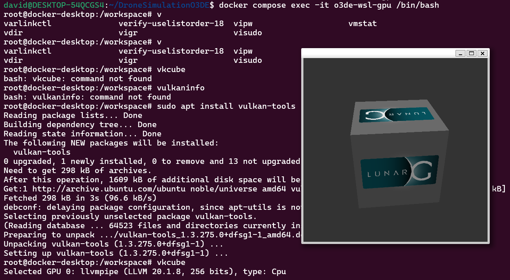
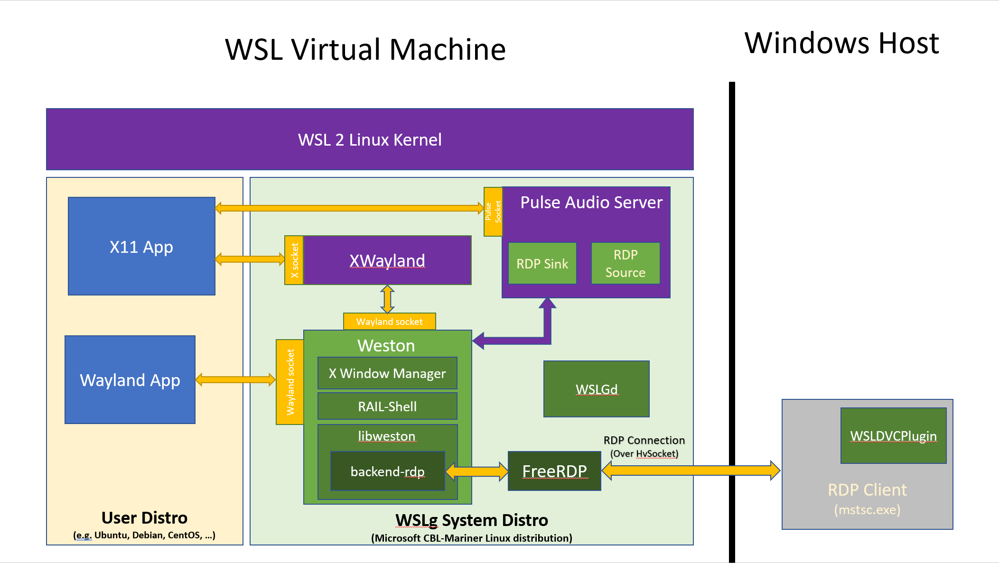
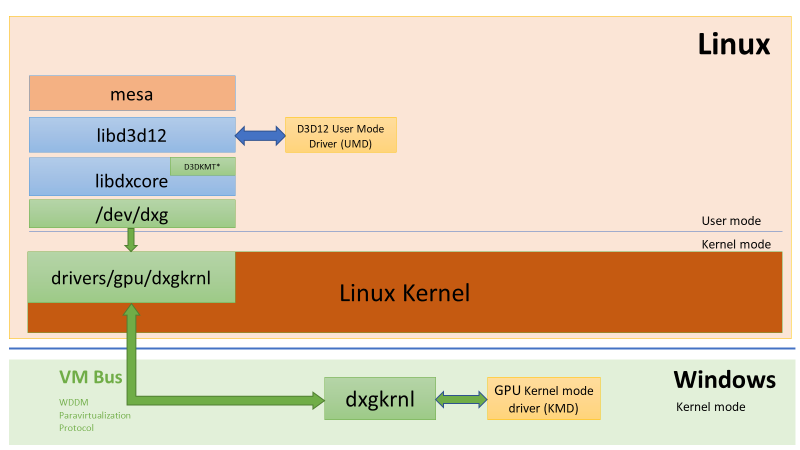

#HEADER WSLg with Docker
Using WSLg from within Docker with Vulkan support
#END HEADER

Recently WSL2 came out with the feature allowing you to have X11 or Wayland applications work within WSL and get displayed to your windows desktop. But this feature doesnt work out of the box with Docker (which uses WSL2 internally on windows) so this documents how to get it to work.

This comes from my work on my drone simulator in o3de, After dockerizing it I wanted to see if I could get it to run on windows

## WSLg Archiecture


So in any WSL distro, the environment variables are all properly set and `/mnt/wslg` is mounted so the applications work without any configuration but this isn't the case **inside** our docker container

Now this setup is purely concerned with displaying windows onto the screen in windows when we need GPU acceleration we have to use a `vGPU` bridge between WSL & DX12

So to do the hookups yourself it looks like this:
```sh
 docker run -it \
    -v /tmp/.X11-unix:/tmp/.X11-unix \
    -v /mnt/wslg:/mnt/wslg \
    -v /usr/lib/wsl:/usr/lib/wsl --device=/dev/dxg \
    -e DISPLAY=$DISPLAY \
    -e WAYLAND_DISPLAY=$WAYLAND_DISPLAY -e XDG_RUNTIME_DIR=$XDG_RUNTIME_DIR \
    -e PULSE_SERVER=$PULSE_SERVER \
    --gpus all videoaccel
```
This command  should be run from another WSL distro with [Docker <-> WSL integration](https://docs.docker.com/desktop/features/wsl/#enable-docker-in-a-wsl-2-distribution) enabled (so you can use the docker command)

This command is also only if you have a GPU you want to passthrough, if not then you can use this simplified version:

```sh
docker run -it \
    -v /tmp/.X11-unix:/tmp/.X11-unix \
    -v /mnt/wslg:/mnt/wslg \
    -e DISPLAY=$DISPLAY \
    -e WAYLAND_DISPLAY=$WAYLAND_DISPLAY \
    -e XDG_RUNTIME_DIR=$XDG_RUNTIME_DIR \
    -e PULSE_SERVER=$PULSE_SERVER xclock
```

#f for docker compose
```
  o3de-wsl-gpu:
    <<: *o3de-base
    devices:
      - /dev/dxg
    environment:
      - DISPLAY=${DISPLAY}
      - WAYLAND_DISPLAY=${WAYLAND_DISPLAY}
      - XDG_RUNTIME_DIR=${XDG_RUNTIME_DIR}
      - PULSE_SERVER=${PULSE_SERVER}
      - QT_X11_NO_MITSHM=1
      - ROS_DOMAIN_ID=${ROS_DOMAIN_ID:-1}
      - QT_QPA_PLATFORM=xcb
      - NVIDIA_DRIVER_CAPABILITIES=all
      - LIBVA_DRIVER_NAME=d3d12
      - LD_LIBRARY_PATH=/usr/lib/wsl/lib
    volumes:
      - /tmp/.X11-unix:/tmp/.X11-unix:rw
      - /mnt/wslg:/mnt/wslg:rw
      - /usr/lib/wsl:/usr/lib/wsl:rw
      - .:/workspace
    deploy:
      resources:
        reservations:
          devices:
            - driver: nvidia
              count: all
              capabilities: [gpu]
```
#END f

## vGPU & DirectX


dxgkrnl is a custom linux kernel driver that communicates over the VM bus to the windows GPU driver and uses this connection to talk to the physical GPU

But nothing on linux speaks DirectX for obvious reasons and right now only DirectX is passed through, so any applications on linux using OpenGL, OpenCL or Vulkan use a [MESA translation layer to DirectX](https://devblogs.microsoft.com/directx/in-the-works-opencl-and-opengl-mapping-layers-to-directx/) before communicating with the GPU.

⚠ Docker Desktop includes the Nvidia Container Runtime by default on windows so you needn't install it seperatley.

## MESA & Vulkan
Unfortunatley this MESA component is only in up-to-date versions of mesa so for Ubuntu generally you need to update the mesa version:

```sh
sudo add-apt-repository ppa:kisak/kisak-mesa
sudo apt update
sudo apt upgrade
```

on Arch you need to install `mesa` & `vulkan-dzn`

⚠ `dzn` unfortunatley isnt fully compliant yet and it is a WIP so some applications (like O3DE 😢) may not work / crash. So you might have to use `llvmpipe` which is basically software rendering but through vulkan.

### Selecting specific devices


## Sources
- [WSLg README](https://github.com/microsoft/wslg/tree/main)
- [DirectX Blog Post](https://devblogs.microsoft.com/directx/directx-heart-linux/)
